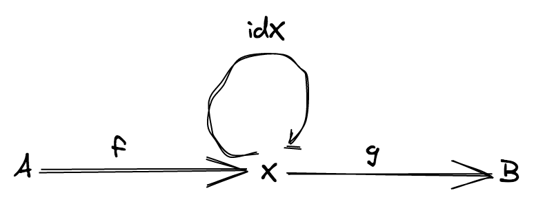
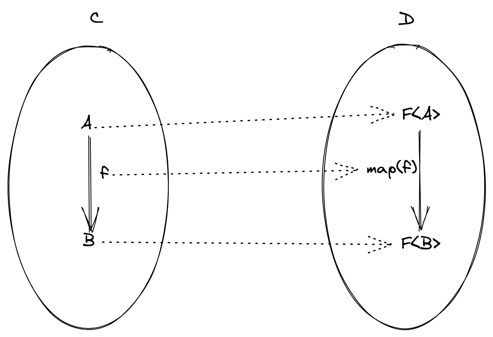

이 저장소는 TypeScript를 사용하는 함수형 프로그래밍 개념과 fp-ts 생태계의 라이브러리를 소개합니다.

이 사본은 [Giulio Canti](https://gcanti.github.io/about.html)의 ["Introduction to Functional Programming (Italian)"](https://github.com/gcanti/functional-programming)의 번역본입니다. 저자는 함수형 프로그래밍에 대한 강의와 워크숍을 위해 원본을 참고 자료로 사용합니다.

사본의 목적은 개념이나 구조를 변경하지 않고 자료를 확장하는 것입니다. 목표에 대한 자세한 내용은 [CONTRIBUTING](/CONTRIBUTING.md) 파일을 참조하십시오.

**설정하기**

```sh
git clone https://github.com/gcanti/functional-programming.git
cd functional-programming
npm i
```

# 함수형 프로그래밍이란

> 함수형 프로그래밍은 순수 함수(수학 함수)를 이용해 프로그래밍하는 것입니다.

인터넷에서 검색하면 다음 정의를 찾을 수 있습니다.

> (순수) 함수는 같은 입력이 주어지면 부작용 없이 항상 같은 출력을 반환하는 프로시저입니다.

"부작용"이라는 단어는 아직 구체적인 의미가 없습니다(앞으로 공식적인 정의를 제공하는 방법을 살펴보겠습니다). 중요한 것은 일종의 직관을 갖고 파일을 열거나 데이터베이스에 쓰는 것에 대해 생각하는 것입니다.

당분간 우리는 부작용이 값을 반환하는 것 외에 함수가 하는 *모든 것*이라고 스스로 제한할 수 있습니다.

순수 함수만 사용하는 프로그램의 구조는 무엇일까요?

함수형 프로그램은 **파이프라인**처럼 작성되는 경향이 있습니다.

```ts
const program = pipe(
  input,
  f1, // 순수 함수
  f2, // 순수 함수
  f3, // 순수 함수
  ...
)
```

여기서 일어나는 일은 `input`이 첫 번째 함수 `f1`에 전달되고 두 번째 함수 `f2`에 전달되는 값을 반환하고, 두 번째 함수에서 세 번째 함수 `f3`에 인자로 전달되는 값을 반환하는 것 등이 있습니다.

**데모**

[`00_pipe_and_flow.ts`](src/00_pipe_and_flow.ts)

함수형 프로그래밍이 해당 스타일로 코드를 구조화하는 도구를 제공하는 방법을 살펴보겠습니다.

함수형 프로그래밍이 *무엇*인지 이해하는 것 외에도 함수형 프로그래밍의 목적을 이해하는 것도 중요합니다.

함수형 프로그래밍의 목표는 형식적인 *모델*을 사용해 **시스템의 복잡성을 줄이고** **코드의 속성**과 리팩토링을 용이하게 하는 것에 중점을 두는 것입니다.

> 함수형 프로그래밍은 사람들에게 프로그램 구성 뒤에 있는 수학을 가르치는 데 도움이 될 것입니다.
>
> - 합성 가능한 코드를 작성하는 방법
> - 부작용에 대해 추론하는 방법
> - 일관되고 일반적이며 덜 임시적인 API를 작성하는 방법

코드의 속성에 중점을 둔다는 것은 무엇을 의미할까요? 예시를 들어 보겠습니다.

**예시**

`Array`의 `map` 메소드가 `for` 루프보다 "더 함수적"이라고 말할 수 있는 이유는 무엇일까요?

```ts
// 입력
const xs: Array<number> = [1, 2, 3]

// 변환
const double = (n: number): number => n * 2

// 결과: `xs`의 각 요소가 2배가 되는 배열을 원합니다.
const ys: Array<number> = []
for (let i = 0; i <= xs.length; i++) {
  ys.push(double(xs[i]))
}
```

`for` 루프는 많은 유연성을 제공하며, 아래와 같이 수정할 수 있습니다.

- 시작 인덱스 `let i = 0`
- 반복 조건, `i < xs.length`
- 단계별 변경, `i++`.

이것은 또한 **오류**가 발생할 수 있으며 반환값을 보장할 수 없음을 의미합니다.

**퀴즈**: `for 루프`가 올바르게 작성되었나요?

> [정답은 여기](src/quiz-answers/for-loop.md)에서 확인할 수 있습니다.

`map`을 사용하여 같은 예시를 다시 작성해 봅시다.

```ts
// 입력
const xs: Array<number> = [1, 2, 3]

// 변환
const double = (n: number): number => n * 2

// 결과: `xs`의 각 요소가 2배가 되는 배열을 원합니다.
const ys: Array<number> = xs.map(double)
```

`map`이 `for 루프`와 같은 유연성이 부족하다는 것을 알 수 있지만 몇 가지를 보장합니다.

- 입력 배열의 모든 요소가 처리됩니다.
- 결과 배열은 항상 시작 배열과 동일한 수의 요소를 갖습니다.

세부 구현보다 코드 속성에 중점을 두는 함수형 프로그래밍에서 `map` 연산은 **제한으로 인해** 흥미롭습니다.

`for` 루프보다 `map`이 포함된 Pull Request를 검토하는 것이 얼마나 쉬울지 생각해 보세요.

# 함수형 프로그래밍의 두 기둥

함수형 프로그래밍은 다음 두 기둥을 기반으로 합니다.

- 참조 투명성
- 합성 (일반적인 디자인 패턴으로)

나머지는 모두 이 두 지점에서 직접적, 간접적으로 파생됩니다.

## 참조 투명성

> **정의**: **식**은 프로그램의 동작을 변경하지 않고 해당 값으로 대체할 수 있는 경우 *참조적으로 투명*하다고 합니다.

**예시** (참조 투명성은 순수 함수의 사용을 의미합니다.)

```ts
const double = (n: number): number => n * 2

const x = double(2)
const y = double(2)
```

`double(2)` 식은 숫자 4로 대체할 수 있기 때문에 참조 투명성을 가집니다.

따라서 다음과 같이 리팩토링을 진행할 수 있습니다.

```ts
const x = 4
const y = x
```

모든 표현식이 참조적으로 투명한 것은 아닙니다. 예시를 살펴보겠습니다.

**예시** (참조 투명성은 예외를 던지지 않음을 의미합니다.)

```ts
const inverse = (n: number): number => {
  if (n === 0) throw new Error('cannot divide by zero')
  return 1 / n
}

const x = inverse(0) + 1
```

`inverse(0)`을 해당 값으로 대체할 수 없으므로 참조 투명성을 갖지 않습니다.

**예시** (참조 투명성을 위해서는 불변 데이터 구조를 사용해야 합니다.)

```ts
const xs = [1, 2, 3]

const append = (xs: Array<number>): void => {
  xs.push(4)
}

append(xs)

const ys = xs
```

마지막 줄에서 `xs`는 `append`를 호출해 변경되었기 때문에 초기 값 `[1, 2, 3]`으로 대체할 수 없습니다.

참조 투명성이 왜 그렇게 중요할까요? 참조 투명성은 다음과 같은 이점이 있습니다.

- **지역적 코드에 대한 이유**, 코드의 부분을 이해하기 위해 외부 맥락을 알 필요가 없습니다.
- 시스템 동작을 변경하지 않고 **리팩터링**을 할 수 있습니다.

**퀴즈**: 다음과 같은 프로그램이 있다고 가정해 봅시다.

```ts
// TypeScript에서 `declare`는 구현을 요구하지 않고 정의를 할 수 있습니다.
declare const question: (message: string) => Promise<string>

const x = await question('What is your name?')
const y = await question('What is your name?')
```

이런 방식으로 리팩토링을 할 수 있나요? 프로그램의 동작이 변경되나요? 아니면 변경될 예정인가요?

```ts
const x = await question('What is your name?')
const y = x
```

정답은 `question`의 *구현*을 읽지 않고는 알 수 있는 방법이 없습니다.

보시다시피 참조 투명하지 않은 표현식을 포함하는 프로그램을 리팩터링하는 것은 어려울 수 있습니다.
모든 표현식이 참조적으로 투명한 함수형 프로그래밍에서는 변경에 필요한 생각이 ​​크게 줄어듭니다.

## 합성

함수형 프로그래밍의 기본 패턴은 *합성*입니다. 매우 구체적인 작업을 수행하는 작은 코드 단위를 더 크고 복잡한 단위로 합성합니다.

우리가 생각할 수 있는 "가장 작은 것에서 가장 큰 것" 합성 패턴의 예시는 다음과 같습니다.

- 두 개 이상의 원시 값(숫자 또는 문자열) 합성
- 2개 이상의 함수 합성
- 전체 프로그램 합성

마지막 예에서 우리는 *모듈성 프로그래밍*에 대해 말할 수 있습니다.

> 모듈성 프로그래밍이란 작은 프로그램을 함께 붙여서 큰 프로그램을 만드는 과정을 의미합니다. - Simon Peyton Jones

이 프로그래밍 스타일은 결합자를 사용해 달성할 수 있습니다.

**결합자**라는 용어는 [결합자 패턴](https://wiki.haskell.org/Combinator)을 참조합니다.

> 사물을 결합한다는 아이디어를 기반으로 라이브러리를 합성하는 방식입니다. 일반적으로 일부 `T` 타입, `T` 타입의 일부 "원시" 값 및 `T` 타입의 값을 다양한 방식으로 합성하여 `T` 타입보다 복잡한 값을 구축할 수 있는 일부 "결합자"가 있습니다.

결합자의 일반적인 개념은 다소 모호하고 다양한 형태로 나타날 수 있지만 가장 간단한 것은 다음과 같습니다.

```ts
combinator: Thing -> Thing
```

**예시**: `double` 함수는 두 개의 숫자를 결합합니다.

결합자의 목표는 이미 정의된 *Thing*에서 새로운 *Thing*를 생성하는 것입니다.

결합자의 출력인 새로운 *Thing*은 다른 프로그램과 결합자에 대한 입력으로 전달될 수 있기 때문에 이 패턴을 매우 강력하게 만드는 폭발적인 결합의 기회를 얻습니다.

**예시**

```ts
import { pipe } from 'fp-ts/function'

const double = (n: number): number => n * 2

console.log(pipe(2, double, double, double)) // => 16
```

따라서 함수형 모듈에서 볼 수 있는 일반적인 설계는 다음과 같습니다.

- 일부 `T` 타입에 대한 모델
- `T` 타입의 작은 "원시" 집합
- 더 큰 구조에서 원시 요소를 결합하기 위한 결합자 집합

이런 모듈을 구현해 봅시다.

**데모**

[`01_retry.ts`](src/01_retry.ts)

데모에서 볼 수 있듯이 3개의 원시 요소와 2개의 결합자로 꽤 복잡한 정책을 표현할 수 있었습니다.

하나의 새로운 원시 요소 또는 이미 정의된 것에 하나의 결합자를 추가하는 것만으로도 표현 가능성이 기하급수적으로 추가되는 방식을 생각해 보세요.

`01_retry.ts`에 있는 두 결합자 중에서 `concat`은 매우 강력한 함수형 프로그래밍 추상화인 세미그룹을 참조하기 때문에 특별히 언급됩니다.

# 세미그룹으로 합성 모델링하기

세미그룹은 두 개 이상의 값을 결합하는 방법입니다.

세미그룹은 **대수**이며 일반적으로 다음의 특정 조합으로 정의됩니다.

- 하나 이상의 집합
- 해당 집합에 대한 하나 이상의 연산
- 이전 연산에 대한 0개 이상의 법칙

대수은 수학자들이 아이디어를 가장 순수한 형태로 포착해 불필요한 모든 것을 제거하는 방법입니다.

> 대수이 수정될 때 유일하게 허용되는 연산은 자체 법칙에 따라 대수 자체에 의해 정의된 연산입니다.

대수는 **인터페이스**의 추상화로 생각할 수 있습니다.

> 인터페이스가 수정될 때 허용되는 유일한 연산은 자체 법률에 따라 인터페이스 자체에 의해 정의된 연산입니다.

세미그룹으로 들어가기 전에 먼저 대수의 예시인 *마그마*를 살펴보겠습니다.

## 마그마의 정의

Magma<A>는 매우 간단한 대수입니다.

- 집합 또는 타입 (A)
- `concat` 연산
- 지켜야 할 법칙이 없습니다.

**참고**: 대부분의 경우 *set*과 *type*이라는 용어는 같은 의미로 사용할 수 있습니다.

TypeScript의 `interface`를 이용해 마그마를 모델링할 수 있습니다.

```ts
interface Magma<A> {
  readonly concat: (first: A, second: A) => A
}
```

따라서 우리는 대수의 요소를 가지고 있습니다.

- 집합 `A`
- 집합 `A`에 대한 `concat` 연산. 이 작업은 집합 `A`에서 _닫혀있다고_ 합니다. 이는 결과에 연산을 적용하는 요소 `A`가 여전히 `A`의 요소임을 의미합니다. 결과는 여전히 `A`이므로 `concat`의 입력으로 다시 사용할 수 있으며 원하는 만큼 작업을 반복할 수 있습니다. 즉 `concat`은 `A` 타입에 대한 `결합자`입니다.

`A`가 `number` 타입인 `Magma<A>`의 구체적인 인스턴스를 구현해 봅시다.

```ts
import { Magma } from 'fp-ts/Magma'

const MagmaSub: Magma<number> = {
  concat: (first, second) => first - second
}

// helper
const getPipeableConcat = <A>(M: Magma<A>) => (second: A) => (first: A): A =>
  M.concat(first, second)

const concat = getPipeableConcat(MagmaSub)

// 사용 예시

import { pipe } from 'fp-ts/function'

pipe(10, concat(2), concat(3), concat(1), concat(2), console.log)
// => 2
```

**퀴즈**: `concat`이 *닫혀있는* 작업이라는 사실은 사소한 내용이 아닙니다. 만약 `A`가 JavaScript의 숫자 타입(양수 및 음수 부동 집합)이 아닌 자연수 집합(양의 정수)인 우리가 구현한 `MagmaSub`와 같이 `concat`을 사용해 `Magma<Natural>`을 정의할 수 있을까요? `closure` 속성이 유효하지 않은 자연수에 대한 다른 `concat` 작업을 생각할 수 있을까요?

> [정답은 여기](src/quiz-answers/magma-concat-closed.md)에서 확인할 수 있습니다.

**정의**: `A`가 비어 있지 않은 집합이고 `*`가 *닫혀있는*(또는 *내부적인*) `A`인 이항 연산인 경우 `(A, *)` 쌍을 *마그마*라고 합니다.

마그마는 어떤 법칙도 따르지 않으며 폐쇠(`closure`) 요구 사항만 있습니다. 또 다른 법칙이 필요한 대수인 세미그룹을 보겠습니다.

## 세미그룹의 정의

> `concat` 연산이 **결합적**인 `Magma`가 주어지면 *세미그룹*입니다.

"결합적"이라는 용어는 다음 방정식을 의미합니다.

```ts
(x * y) * z = x * (y * z)

// 또는
concat(concat(a, b), c) = concat(a, concat(b, c))
```

`A`인 모든 `x`, `y`, `z`에 적용됩니다.

*결합법칙*은 표현식에서 괄호에 대해 걱정할 필요가 없으며 간단히 `x * y * z`라고 쓸 수 있음을 알려줍니다. (모호함 없음)

**예시**

문자열 연결은 결합법칙의 이점을 제공합니다.

```ts
("a" + "b") + "c" = "a" + ("b" + "c") = "abc"
```

모든 세미그룹은 마그마이지만 모든 마그마가 세미그룹은 아닙니다.

<center>

</center>

**예시**

이전 `MagmaSub`는 `concat` 작업이 결합적이지 않기 때문에 세미그룹이 아닙니다.

```ts
import { pipe } from 'fp-ts/function'
import { Magma } from 'fp-ts/Magma'

const MagmaSub: Magma<number> = {
  concat: (first, second) => first - second
}

pipe(MagmaSub.concat(MagmaSub.concat(1, 2), 3), console.log) // => -4
pipe(MagmaSub.concat(1, MagmaSub.concat(2, 3)), console.log) // => 2
```

세미그룹은 병렬화 작업의 본질을 포착합니다.

결합법칙을 따르는 연산이 있다는 것을 안다면 계산을 두 개의 하위 계산으로 더 나눌 수 있고, 각각은 하위 계산으로 더 나눌 수 있습니다.

```ts
a * b * c * d * e * f * g * h = ((a * b) * (c * d)) * ((e * f) * (g * h))
```

곱셈은 병렬적으로 실행할 수 있습니다.

`Magma`와 `Semigroup`은 TypeScript의 `인터페이스`를 이용해 구현됩니다.

```ts
// fp-ts/lib/Semigroup.ts

interface Semigroup<A> extends Magma<A> {}
```

다음 법칙이 적용되어야 합니다.

- **결합법칙**: `S`가 세미그룹인 경우 다음이 참이어야 합니다.

```ts
S.concat(S.concat(x, y), z) = S.concat(x, S.concat(y, z))
```

`A` 타입인 모든 `x`, `y`, `z`에 대해 만족해야 합니다.

**참고**: 안타깝게도 TypeScript의 타입 시스템을 이용해 이 법칙을 인코딩하는 것은 불가능합니다.

`ReadonlyArray<string>`에 대한 세미그룹을 구현해 보겠습니다.

```ts
import * as Se from 'fp-ts/Semigroup'

const Semigroup: Se.Semigroup<ReadonlyArray<string>> = {
  concat: (first, second) => first.concat(second)
}
```

`concat`이라는 이름은 배열에 대해 의미가 있지만(나중에 살펴보겠지만) 컨텍스트와 인스턴스를 구현하는 `A` 타입에 따라 `concat` 세미그룹 연산은 다른 해석과 의미를 가질 수 있습니다.

- "연결"
- "조합"
- "병합"
- "융합"
- "선택"
- "합"
- "치환"

그리고 다른 많은 것들이 있습니다.

**예시**

다음은 세미그룹 `(number, +)`를 구현하는 방법입니다. 여기서 `+`는 일반적인 숫자 덧셈입니다.

```ts
import { Semigroup } from 'fp-ts/Semigroup'

/** 덧셈을 하는 숫자 `Semigroup` */
const SemigroupSum: Semigroup<number> = {
  concat: (first, second) => first + second
}
```

**퀴즈**: 데모 [`01_retry.ts`](src/01_retry.ts)에 정의된 `concat` 결합자를 사용해 `RetryPolicy` 타입에 대한 `Semigroup` 인스턴스를 정의할 수 있을까요?

> [정답은 여기](src/quiz-answers/semigroup-demo-concat.md)에서 확인할 수 있습니다.

다음은 세미그룹 `(number, *)`에 대한 구현입니다. 여기서 `*`는 일반적인 숫자 곱셈입니다.

```ts
import { Semigroup } from 'fp-ts/Semigroup'

/** 곱셈을 하는 숫자 `Semigroup` */
const SemigroupProduct: Semigroup<number> = {
  concat: (first, second) => first * second
}
```

**참고**: *숫자의 세미그룹*에 대해 생각하는 것은 일반적인 실수이지만 동일한 타입 `A`에 대해 `Semigroup<A>`의 **인스턴스**를 더 많이 정의하는 것이 가능합니다. 우리는 `number`에 대해 *덧셈* 및 *곱셈*에서 세미그룹을 정의하는 방법을 살펴보았습니다. 동일한 작업을 공유하지만 타입이 다른 `Semigroup`을 가질 수도 있습니다. `SemigroupSum`은 `number`와 같은 부호 없는 부동 소수점 대신 자연수에서도 구현될 수 있었습니다.

`string` 타입을 사용하는 또 다른 예시가 있습니다.

```ts
import { Semigroup } from 'fp-ts/Semigroup'

const SemigroupString: Semigroup<string> = {
  concat: (first, second) => first + second
}
```

이번에는 `boolean` 타입을 사용하는 다른 두 가지 예시가 있습니다.

```ts
import { Semigroup } from 'fp-ts/Semigroup'

const SemigroupAll: Semigroup<boolean> = {
  concat: (first, second) => first && second
}

const SemigroupAny: Semigroup<boolean> = {
  concat: (first, second) => first || second
}
```

## `concatAll` 함수

정의에 따라 `concat`은 매번 `A`의 두 요소만 결합합니다. 여러 개를 결합하는 것이 가능할까요?

`concatAll` 함수는 다음을 받습니다.

- 세미그룹의 인스턴스
- 초기값
- 요소 배열

```ts
import * as S from 'fp-ts/Semigroup'
import * as N from 'fp-ts/number'

const sum = S.concatAll(N.SemigroupSum)(2)

console.log(sum([1, 2, 3, 4])) // => 12

const product = S.concatAll(N.SemigroupProduct)(3)

console.log(product([1, 2, 3, 4])) // => 72
```

**Quiz**: 초기 값을 제공해야 하는 이유는 무엇인가요?

-> [정답은 여기](src/quiz-answers/semigroup-concatAll-initial-value.md)에서 확인할 수 있습니다.

**예시**

JavaScript 표준 라이브러리에서 인기 있는 몇가지 기능을 다시 구현하여 `concatAll`을 응용하는 프로그램을 소개하겠습니다.

```ts
import * as B from 'fp-ts/boolean'
import { concatAll } from 'fp-ts/Semigroup'
import * as S from 'fp-ts/struct'

const every = <A>(predicate: (a: A) => boolean) => (
  as: ReadonlyArray<A>
): boolean => concatAll(B.SemigroupAll)(true)(as.map(predicate))

const some = <A>(predicate: (a: A) => boolean) => (
  as: ReadonlyArray<A>
): boolean => concatAll(B.SemigroupAny)(false)(as.map(predicate))

const assign: (as: ReadonlyArray<object>) => object = concatAll(
  S.getAssignSemigroup<object>()
)({})
```

**퀴즈**: 다음 세미그룹 예시는 법칙을 만족하나요?

> [정답은 여기](src/quiz-answers/semigroup-first.md)에서 확인할 수 있습니다.

```ts
import { Semigroup } from 'fp-ts/Semigroup'

/** 항상 첫 번째 인자를 반환 */
const first = <A>(): Semigroup<A> => ({
  concat: (first, _second) => first
})
```

**퀴즈**: 다음 세미그룹 예시는 법칙을 만족하나요?

> [정답은 여기](src/quiz-answers/semigroup-second.md)에서 확인할 수 있습니다.

```ts
import { Semigroup } from 'fp-ts/Semigroup'

/** 항상 두 번째 인자를 반환 */
const last = <A>(): Semigroup<A> => ({
  concat: (_first, second) => second
})
```

## 이중 세미그룹

세미그룹 인스턴스가 주어지면 피연산자가 결합되는 순서를 간단히 바꾸면 새로운 세미그룹 인스턴스를 얻을 수 있습니다.

```ts
import { pipe } from 'fp-ts/function'
import { Semigroup } from 'fp-ts/Semigroup'
import * as S from 'fp-ts/string'

// 이것은 세미그룹 결합자입니다.
const reverse = <A>(S: Semigroup<A>): Semigroup<A> => ({
  concat: (first, second) => S.concat(second, first)
})

pipe(S.Semigroup.concat('a', 'b'), console.log) // => 'ab'
pipe(reverse(S.Semigroup).concat('a', 'b'), console.log) // => 'ba'
```

**퀴즈**: 이 결합자는 일반적으로 `concat` 작업이 [**가환적**](https://en.wikipedia.org/wiki/Commutative_property)이 아니기 때문에 의미가 있습니다. `concat`이 가환적인 예시와 그리고 그렇지 않은 예시를 찾을 수 있나요?

> [정답은 여기](src/quiz-answers/semigroup-commutative.md)에서 확인할 수 있습니다.

## 세미그룹 활용하기

보다 복잡한 타입에 대해 세미그룹 인스턴스를 정의해 보겠습니다.

```ts
import * as N from 'fp-ts/number'
import { Semigroup } from 'fp-ts/Semigroup'

// 원점에서 시작하는 벡터 모델링
type Vector = {
  readonly x: number
  readonly y: number
}

// 두 벡터의 합 모델
const SemigroupVector: Semigroup<Vector> = {
  concat: (first, second) => ({
    x: N.SemigroupSum.concat(first.x, second.x),
    y: N.SemigroupSum.concat(first.y, second.y)
  })
}
```

**예시**

```ts
const v1: Vector = { x: 1, y: 1 }
const v2: Vector = { x: 1, y: 2 }

console.log(SemigroupVector.concat(v1, v2)) // => { x: 2, y: 3 }
```

<center>

</center>

보일러플레이트가 너무 많은가요? 좋은 소식은 세미그룹의 **수학 이론**에 따르면 각 필드에 대한 세미그룹 인스턴스를 구현할 수 있는 경우 `Vector`와 같은 구조체에 대한 세미그룹 인스턴스를 구현할 수 있다는 것입니다.

편리하게도 `fp-ts/Semigroup` 모듈은 `struct` 결합자를 사용할 수 있게합니다.

```ts
import { struct } from 'fp-ts/Semigroup'

// 두 벡터의 합 모델
const SemigroupVector: Semigroup<Vector> = struct({
  x: N.SemigroupSum,
  y: N.SemigroupSum
})
```

**참고**: 튜플로 동작하는 `struct`와 유사한 결합자 `tuple`이 있습니다.

```ts
import * as N from 'fp-ts/number'
import { Semigroup, tuple } from 'fp-ts/Semigroup'

// 원점에서 시작하는 벡터 모델링
type Vector = readonly [number, number]

// 두 벡터의 합 모델
const SemigroupVector: Semigroup<Vector> = tuple(N.SemigroupSum, N.SemigroupSum)

const v1: Vector = [1, 1]
const v2: Vector = [1, 2]

console.log(SemigroupVector.concat(v1, v2)) // => [2, 3]
```

**퀴즈**: `Semigroup<A>`이 주어지고 `A`의 `middle`을 선택한 경우 두 `concat` 매개변수 사이에 삽입하면 결과가 여전히 세미그룹이라는 것이 사실인가요?

```ts
import { pipe } from 'fp-ts/function'
import { Semigroup } from 'fp-ts/Semigroup'
import * as S from 'fp-ts/string'

export const intercalate = <A>(middle: A) => (
  S: Semigroup<A>
): Semigroup<A> => ({
  concat: (first, second) => S.concat(S.concat(first, middle), second)
})

const SemigroupIntercalate = pipe(S.Semigroup, intercalate('|'))

pipe(
  SemigroupIntercalate.concat('a', SemigroupIntercalate.concat('b', 'c')),
  console.log
) // => 'a|b|c'
```

## 모든 타입의 Semigroup 인스턴스 찾기

결합법칙은 매우 강력한 요구 사항입니다. 특정 타입 `A`가 주어졌을 때 `A`에 대한 결합성을 찾을 수 없다면 어떻게 될까요?

다음과 같이 정의된 `User` 타입이 있다고 가정해 봅시다.

```ts
type User = {
  readonly id: number
  readonly name: string
}
```

그리고 데이터베이스 안에는 동일한 `User`의 여러 복사본이 있습니다. (예시: 수정 사항에 대한 기록일 수 있습니다.)

```ts
// 내부 API
declare const getCurrent: (id: number) => User
declare const getHistory: (id: number) => ReadonlyArray<User>
```

공개 API를 구현해야 합니다.

```ts
export declare const getUser: (id: number) => User
```

일부 기준에 따라 모든 사본을 고려해야 합니다. 기준은 가장 최근 사본 또는 가장 오래된 사본 또는 현재 사본 등을 반환하는 것입니다.

당연히 각 기준에 대해 특정 API를 다음과 같이 정의할 수 있습니다.

```ts
export declare const getMostRecentUser: (id: number) => User
export declare const getLeastRecentUser: (id: number) => User
export declare const getCurrentUser: (id: number) => User
// 등등...
```

따라서 `User` 타입의 값을 반환하려면 모든 복사본을 고려하고 `병합`(또는 `선택`)해야 합니다. 즉, `Semigroup<User>`로 기준 문제를 모델링할 수 있습니다.

즉, "두 개의 `사용자`를 병합"하는 것이 무엇을 의미하는지, 이 병합 작업이 연관되는지 여부가 지금 당장은 명확하지 않습니다.

`A` 자체가 아닌 `NonEmptyArray<A>`에 대한 세미그룹 인스턴스를 정의하여 **항상** 주어진 타입 `A`에 대한 세미그룹 인스턴스인 **자유 세미그룹**을 정의할 수 있습니다.

```ts
import { Semigroup } from 'fp-ts/Semigroup'

// 비어 있지 않은 배열을 나타냅니다. 즉, 요소 ​​A가 하나 이상 있는 배열을 의미합니다.
type ReadonlyNonEmptyArray<A> = ReadonlyArray<A> & {
  readonly 0: A
}

// 두 NonEmptyArray의 연결은 여전히 ​​NonEmptyArray입니다.
const getSemigroup = <A>(): Semigroup<ReadonlyNonEmptyArray<A>> => ({
  concat: (first, second) => [first[0], ...first.slice(1), ...second]
})
```

그런 다음 `A`의 요소를 요소가 하나뿐인 배열을 의미하는 `ReadonlyNonEmptyArray<A>`의 "싱글톤"에 사상할 수 있습니다.

```ts
// 비어 있지 않은 배열에 요소 삽입
const of = <A>(a: A): ReadonlyNonEmptyArray<A> => [a]
```

이 기술을 `User` 타입에 적용해 보겠습니다.

```ts
import {
  getSemigroup,
  of,
  ReadonlyNonEmptyArray
} from 'fp-ts/ReadonlyNonEmptyArray'
import { Semigroup } from 'fp-ts/Semigroup'

type User = {
  readonly id: number
  readonly name: string
}

// 이 세미그룹은 `User` 타입이 아니라 `ReadonlyNonEmptyArray<User>`용입니다.
const S: Semigroup<ReadonlyNonEmptyArray<User>> = getSemigroup<User>()

declare const user1: User
declare const user2: User
declare const user3: User

// const merge: ReadonlyNonEmptyArray<User>
const merge = S.concat(S.concat(of(user1), of(user2)), of(user3))

// 사용자를 배열에 수동으로 "담아" 동일한 결과를 얻을 수 있습니다.
const merge2: ReadonlyNonEmptyArray<User> = [user1, user2, user3]
```

따라서 `A`의 자유 세미그룹은 요소가 모두 가능한 `A`의 유한 시퀀스인 비어 있지 않은 또 다른 세미그룹일 뿐입니다.

`A`의 자유 세미그룹은 데이터 내용을 보존하면서 `A` 타입의 요소를 `concat`하는 _지연_ 방식으로 볼 수 있습니다.

`[user1, user2, user3]`을 포함하는 `merge` 값은 연결할 요소와 순서를 알려줍니다.

이제 `getUser` API를 설계할 수 있는 세 가지 가능한 옵션이 있습니다.

1. `Semigroup<User>`를 정의할 수 있으며 바로 `병합`하고 싶은 경우

```ts
declare const SemigroupUser: Semigroup<User>

export const getUser = (id: number): User => {
  const current = getCurrent(id)
  const history = getHistory(id)
  return concatAll(SemigroupUser)(current)(history)
}
```

2. `Semigroup<User>`를 정의할 수 없거나 병합 전략을 구현에 공개하고 싶기 때문에 API 소비자에게 요청하는 경우

```ts
export const getUser = (SemigroupUser: Semigroup<User>) => (
  id: number
): User => {
  const current = getCurrent(id)
  const history = getHistory(id)
  // 즉시 병합
  return concatAll(SemigroupUser)(current)(history)
}
```

3. `Semigroup<User>`를 정의할 수 없으며 요구하고 싶지 않은 경우

이 경우 `User`의 자유 세미그룹이 도움이 될 수 있습니다.

```ts
export const getUser = (id: number): ReadonlyNonEmptyArray<User> => {
  const current = getCurrent(id)
  const history = getHistory(id)
  // 병합을 진행하지 않고 User 자유 세미그룹을 반환합니다.
  return [current, ...history]
}
```

`Semigroup<A>` 인스턴스가 있는 경우에도 다음과 같은 이유로 자유 세미그룹을 사용하는 것이 편리할 수 있습니다.

- 비용이 많이 들고 무의미한 계산 실행을 방치하고 싶은 경우
- 세미그룹 인스턴스를 전달하고 싶지 않은 경우
- API 소비자가 올바른 병합 전략을 결정할 수 있는 경우 (`concatAll` 사용)

## 순서 추론이 가능한 세미그룹

주어진 `number`가 **전순서**인 경우(즉, `x`와 `y`를 선택하면 `x <= y` 또는 `y <= x`의 두 조건 중 하나가 참이어야 합니다.) `min` 또는 `max` 연산을 사용해 또 다른 두 개의 `Semigroup<number>` 인스턴스를 정의할 수 있습니다.

```ts
import { Semigroup } from 'fp-ts/Semigroup'

const SemigroupMin: Semigroup<number> = {
  concat: (first, second) => Math.min(first, second)
}

const SemigroupMax: Semigroup<number> = {
  concat: (first, second) => Math.max(first, second)
}
```

**퀴즈**: `숫자`가 *전*순서라는 것이 왜 중요할까요?

`number`와 다른 타입에 대해 이런 세미그룹(`SemigroupMin`과 `SemigroupMax`)을 정의하는 것은 매우 유용합니다.

다른 타입에 대해 _전순서_ 개념을 포착할 수 있나요?

*순서*에 대해 이야기하려면 먼저 *동등성*의 개념을 파악해야 합니다.

# `Eq`를 이용한 동등성 모델링

다시 말하지만, 우리는 동등의 개념을 모델링할 수 있습니다.

*동등 관계*는 동일한 타입의 요소의 *동등성* 개념을 포착합니다. *동등 관계*의 개념은 인터페이스를 사용하여 다음과 같이 TypeScript에서 구현할 수 있습니다.

```ts
interface Eq<A> {
  readonly equals: (first: A, second: A) => boolean
}
```

직관적으로

- `equals(x, y) = true`이면 `x`와 `y`가 같다고 합니다.
- `equals(x, y) = false`이면 `x`와 `y`가 다르다고 합니다.

**예시**

이것은 `number` 타입에 대한 `Eq`의 인스턴스입니다.

```ts
import { Eq } from 'fp-ts/Eq'
import { pipe } from 'fp-ts/function'

const EqNumber: Eq<number> = {
  equals: (first, second) => first === second
}

pipe(EqNumber.equals(1, 1), console.log) // => true
pipe(EqNumber.equals(1, 2), console.log) // => false
```

다음 법칙을 만족해야 합니다.

1. **재귀성**: `A`인 모든 `x`에 대해 `equals(x, x) === true`를 만족해야 합니다.
2. **대칭성**: `A`인 모든 `x`, `y`에 대해 `equals(x, y) === equals(y, x)`를 만족해야 합니다.
3. **추이적**: `A`인 모든 `x`, `y`, `z`에 대해 `equals(x, y) === true`이고 `equals(y, z) === true`라면 `equals(x, z) === true`를 만족해야 합니다.

**퀴즈**: 결합자 `reverse: <A>(E: Eq<A>) => Eq<A>`가 의미가 있을까요?

**퀴즈**: 결합자 `not: <A>(E: Eq<A>) => Eq<A>`가 의미가 있을까요?

```ts
import { Eq } from 'fp-ts/Eq'

export const not = <A>(E: Eq<A>): Eq<A> => ({
  equals: (first, second) => !E.equals(first, second)
})
```

**예시**

주어진 값이 `ReadonlyArray`의 요소인지 확인하는 `elem` 함수를 정의해 `Eq` 추상화를 사용하는 첫 번째 예시를 살펴보겠습니다.

```ts
import { Eq } from 'fp-ts/Eq'
import { pipe } from 'fp-ts/function'
import * as N from 'fp-ts/number'

// returns `true` if the element `a` is included in the list `as`
const elem = <A>(E: Eq<A>) => (a: A) => (as: ReadonlyArray<A>): boolean =>
  as.some((e) => E.equals(a, e))

pipe([1, 2, 3], elem(N.Eq)(2), console.log) // => true
pipe([1, 2, 3], elem(N.Eq)(4), console.log) // => false
```

배열의 기본 메소드인 `includes`을 사용하지 않는 이유는 무엇일까요?

```ts
console.log([1, 2, 3].includes(2)) // => true
console.log([1, 2, 3].includes(4)) // => false
```

좀 더 복잡한 타입을 위한 `Eq` 인스턴스를 정의해 보겠습니다.

```ts
import { Eq } from 'fp-ts/Eq'

type Point = {
  readonly x: number
  readonly y: number
}

const EqPoint: Eq<Point> = {
  equals: (first, second) => first.x === second.x && first.y === second.y
}

console.log(EqPoint.equals({ x: 1, y: 2 }, { x: 1, y: 2 })) // => true
console.log(EqPoint.equals({ x: 1, y: 2 }, { x: 1, y: -2 })) // => false
```

`elem` 함수와 `includes` 함수의 결과를 확인해 봅시다.

```ts
const points: ReadonlyArray<Point> = [
  { x: 0, y: 0 },
  { x: 1, y: 1 },
  { x: 2, y: 2 }
]

const search: Point = { x: 1, y: 1 }

console.log(points.includes(search)) // => false :(
console.log(pipe(points, elem(EqPoint)(search))) // => true :)
```

**퀴즈** (JavaScript): 왜 `includes` 메소드가 `false`를 반환할까요?

-> [정답은 여기](src/quiz-answers/javascript-includes.md)에서 확인할 수 있습니다.

동등성의 개념을 추상화하는 것은 특히 일부 데이터 타입이 사용자 정의 동등을 확인하기 위한 편리한 API를 제공하지 않는 JavaScript와 같은 언어에서 가장 중요합니다.

JavaScript에 내장 되어있는 `Set` 데이터 타입은 같은 문제로 인해 어려움을 겪습니다.

```ts
type Point = {
  readonly x: number
  readonly y: number
}

const points: Set<Point> = new Set([{ x: 0, y: 0 }])

points.add({ x: 0, y: 0 })

console.log(points)
// => Set { { x: 0, y: 0 }, { x: 0, y: 0 } }
```

`Set`이 값을 비교하기 위해 `===`("엄격한 동등")을 사용한다는 사실을 감안할 때 `points`에는 이제 `{ x: 0, y: 0 }`의 **두 개의 동일한 복사본**이 포함되며 우리는 이런 결과를 확실히 원하지 않았습니다. 따라서 `Eq` 추상화를 사용하는 `Set`에 요소를 추가하는 새 API를 정의하는 것이 편리합니다.

**퀴즈**: 이 API의 시그니처는 무엇일까요?

`EqPoint`에 너무 많은 보일러플레이트가 필요한가요? 좋은 소식은 각 필드에 대해 `Eq` 인스턴스를 정의할 수 있는 경우 `Point`와 같은 구조체에 대해 `Eq` 인스턴스를 구현할 가능성을 제공한다는 것입니다.

편리하게도 `fp-ts/Eq` 모듈은 `struct` 결합자를 사용할 수 있게합니다.

```ts
import { Eq, struct } from 'fp-ts/Eq'
import * as N from 'fp-ts/number'

type Point = {
  readonly x: number
  readonly y: number
}

const EqPoint: Eq<Point> = struct({
  x: N.Eq,
  y: N.Eq
})
```

**참고**: 세미그룹과 마찬가지로 `struct`와 같은 데이터 타입에 국한되지 않고 튜플 을 위한 결합자 `tuple`도 있습니다.

```ts
import { Eq, tuple } from 'fp-ts/Eq'
import * as N from 'fp-ts/number'

type Point = readonly [number, number]

const EqPoint: Eq<Point> = tuple(N.Eq, N.Eq)

console.log(EqPoint.equals([1, 2], [1, 2])) // => true
console.log(EqPoint.equals([1, 2], [1, -2])) // => false
```

`fp-ts`에서 사용할 수 있는 다른 결합자가 있습니다. 여기에서 `ReadonlyArray`에 대한 `Eq` 인스턴스를 파생시킬 수 있는 결합자를 확인할 수 있습니다.

```ts
import { Eq, tuple } from 'fp-ts/Eq'
import * as N from 'fp-ts/number'
import * as RA from 'fp-ts/ReadonlyArray'

type Point = readonly [number, number]

const EqPoint: Eq<Point> = tuple(N.Eq, N.Eq)

const EqPoints: Eq<ReadonlyArray<Point>> = RA.getEq(EqPoint)
```

세미그룹과 비슷하게 주어진 동일한 타입에 대해 하나 이상의 `Eq` 인스턴스를 정의할 수 있습니다. 다음 타입으로 `User`를 모델링했다고 가정해 봅시다.

```ts
type User = {
  readonly id: number
  readonly name: string
}
```

`struct` 결합자를 사용해 "표준" `Eq<User>` 인스턴스를 정의할 수 있습니다.

```ts
import { Eq, struct } from 'fp-ts/Eq'
import * as N from 'fp-ts/number'
import * as S from 'fp-ts/string'

type User = {
  readonly id: number
  readonly name: string
}

const EqStandard: Eq<User> = struct({
  id: N.Eq,
  name: S.Eq
})
```

여러 언어, 심지어 Haskell과 같은 순수 함수형 언어도 데이터 타입당 하나 이상의 `Eq` 인스턴스를 허용하지 않습니다. 그러나 `User` 타입의 동등의 의미가 다를 수 있다는 다른 맥락이 있을 수 있습니다. 하나의 일반적인 맥락은 `id` 필드가 동일한 경우 두 `User`는 같습니다.

```ts
/** `id` 필드가 동일한 경우 두 User는 같습니다. */
const EqID: Eq<User> = {
  equals: (first, second) => N.Eq.equals(first.id, second.id)
}
```

이제 데이터 구조로 표현하여 추상적인 개념을 구체적으로 만들었으므로 다른 데이터 구조와 마찬가지로 `Eq` 인스턴스를 프로그래밍 방식으로 다룰 수 있습니다. 예시를 확인해 보겠습니다.

**예시**: `EqId`를 수동으로 정의하는 대신 `contramap` 결합자를 사용할 수 있습니다. 인스턴스 `Eq<A>`와 `B`에서 `A`로의 함수가 주어지면 `Eq<B>`를 파생시킬 수 있습니다.

```ts
import { Eq, struct, contramap } from 'fp-ts/Eq'
import { pipe } from 'fp-ts/function'
import * as N from 'fp-ts/number'
import * as S from 'fp-ts/string'

type User = {
  readonly id: number
  readonly name: string
}

const EqStandard: Eq<User> = struct({
  id: N.Eq,
  name: S.Eq
})

const EqID: Eq<User> = pipe(
  N.Eq,
  contramap((user: User) => user.id)
)

console.log(
  EqStandard.equals({ id: 1, name: 'Giulio' }, { id: 1, name: 'Giulio Canti' })
) // => false (`name` 속성이 다르기 때문에 거짓)

console.log(
  EqID.equals({ id: 1, name: 'Giulio' }, { id: 1, name: 'Giulio Canti' })
) // => true (`name` 속성이 다르더라도 참)

console.log(EqID.equals({ id: 1, name: 'Giulio' }, { id: 2, name: 'Giulio' }))
// => false (`name` 속성이 같더라도 거짓)
```

**퀴즈**: 데이터 타입 `A`가 주어지면 `Semigroup<Eq<A>>`를 정의할 수 있을까요? 그것은 무엇을 표현할 수 있나요?

## `Ord`를 사용한 순서 관계 모델링

`Eq`에 대한 이전 장에서 **동등**의 개념을 다루었습니다. 여기서는 **순서**의 개념을 다루어 보겠습니다.

전순서 관계의 개념은 다음과 같이 TypeScript에서 구현할 수 있습니다.

```ts
import { Eq } from 'fp-ts/lib/Eq'

type Ordering = -1 | 0 | 1

interface Ord<A> extends Eq<A> {
  readonly compare: (x: A, y: A) => Ordering
}
```

다음과 같은 결과를 갖습니다.

- `compare(x, y) = -1`인 경우 `x < y`
- `compare(x, y) = 0`인 경우 `x = y`
- `compare(x, y) = 1`인 경우 `x > y`

**예시**

`number` 타입에 대한 `Ord` 인스턴스를 정의해 봅시다:

```ts
import { Ord } from 'fp-ts/Ord'

const OrdNumber: Ord<number> = {
  equals: (first, second) => first === second,
  compare: (first, second) => (first < second ? -1 : first > second ? 1 : 0)
}
```

다음과 같은 법칙이 만족해야 합니다.

1. **재귀성**: `A`인 모든 `x`에 대하여 `compare(x, x) <= 0`를 만족해야 합니다.
2. **반대칭성**: `A`인 모든 `x`, `y`에 대하여 `compare(x, y) <= 0`이고 `compare(y, x) <= 0`라면 `x = y`입니다.
3. **추이적**: `A`인 `x`, `y`, `z`에 대하여 `compare(x, y) <= 0`이고 `compare(y, z) <= 0`라면 `compare(x, z) <= 0`를 만족해야 합니다.

`compare`는 `Eq`의 `equals` 연산과도 호환되어야 합니다.

`A`인 모든 `x`, `y`에 대해 `equals(x, y) === true`인 경우에 `compare(x, y) === 0`입니다.

**참고**: `equals`은 다음 처럼 `compare`에서 파생될 수 있습니다.

```ts
equals: (first, second) => compare(first, second) === 0
```

사실 `fp-ts/Ord` 모듈에는 `compare` 함수를 전달해 `Ord` 인스턴스를 정의할 수 있는 편리한 `fromCompare`가 있습니다.

```ts
import { Ord, fromCompare } from 'fp-ts/Ord'

const OrdNumber: Ord<number> = fromCompare((first, second) =>
  first < second ? -1 : first > second ? 1 : 0
)
```

**퀴즈**: `move2`가 `move1`을 이길 경우 `move1 <= move2`인 가위바위보 게임에 대한 `Ord` 인스턴스를 정의할 수 있나요?

`ReadonlyArray`의 요소를 정렬하는 `sort` 함수를 정의해 `Ord` 인스턴스의 실제 사용법을 살펴보겠습니다.

```ts
import { pipe } from 'fp-ts/function'
import * as N from 'fp-ts/number'
import { Ord } from 'fp-ts/Ord'

export const sort = <A>(O: Ord<A>) => (
  as: ReadonlyArray<A>
): ReadonlyArray<A> => as.slice().sort(O.compare)

pipe([3, 1, 2], sort(N.Ord), console.log) // => [1, 2, 3]
```

**퀴즈** (JavaScript): 배열의 내장 메소드인 `slice`를 활용하는 이유는 무엇일까요?

두 값 중 가장 작은 값을 반환하는 `min` 함수를 정의해 또 다른 `Ord`의 실용적인 사용법을 살펴보겠습니다.

```ts
import { pipe } from 'fp-ts/function'
import * as N from 'fp-ts/number'
import { Ord } from 'fp-ts/Ord'

const min = <A>(O: Ord<A>) => (second: A) => (first: A): A =>
  O.compare(first, second) === 1 ? second : first

pipe(2, min(N.Ord)(1), console.log) // => 1
```

## 이중 순서

`reverse` 결합자를 사용해 `이중 세미그룹`을 얻기 위해 `concat` 연산을 반전하는 것과 마찬가지로 이중 순서를 얻기 위해 `compare` 연산을 반전할 수 있습니다.

`Ord`에 대한 `reverse` 결합자를 정의해 보겠습니다.

```ts
import { pipe } from 'fp-ts/function'
import * as N from 'fp-ts/number'
import { fromCompare, Ord } from 'fp-ts/Ord'

export const reverse = <A>(O: Ord<A>): Ord<A> =>
  fromCompare((first, second) => O.compare(second, first))
```

`reverse`의 사용 예시는 `min` 함수에서 `max` 함수를 얻는 것입니다.

```ts
import { flow, pipe } from 'fp-ts/function'
import * as N from 'fp-ts/number'
import { Ord, reverse } from 'fp-ts/Ord'

const min = <A>(O: Ord<A>) => (second: A) => (first: A): A =>
  O.compare(first, second) === 1 ? second : first

// const max: <A>(O: Ord<A>) => (second: A) => (first: A) => A
const max = flow(reverse, min)

pipe(2, max(N.Ord)(1), console.log) // => 2
```

순서의 **전체성**(`x` 및 `y`가 주어졌을 때 `x <= y` 또는 `y <= z` 중 하나가 참이어야 함을 의미합니다)은 숫자에 대해서 얘기할 때 명백하게 나타날 수 있지만 항상 렇지는 않습니다. 약간 더 복잡한 경우를 살펴보겠습니다.

```ts
type User = {
  readonly name: string
  readonly age: number
}
```

`User`가 다른 `User`보다 "작거나 같은지"는 ​​명확하지 않습니다.

`Ord<User>` 인스턴스를 어떻게 정의할 수 있을까요?

상황에 따라 다르지만 가능한 선택은 `User`의 나이를 기준으로 정렬하는 것입니다.

```ts
import * as N from 'fp-ts/number'
import { fromCompare, Ord } from 'fp-ts/Ord'

type User = {
  readonly name: string
  readonly age: number
}

const byAge: Ord<User> = fromCompare((first, second) =>
  N.Ord.compare(first.age, second.age)
)
```

다시 `Ord<A>` 인스턴스와 `B`에서 `A`로의 함수를 전달하는 `contramap` 결합자를 사용하여 일부 보일러플레이트를 제거할 수 있으며 `Ord<B>`를 파생시킬 수 있습니다.

```ts
import { pipe } from 'fp-ts/function'
import * as N from 'fp-ts/number'
import { contramap, Ord } from 'fp-ts/Ord'

type User = {
  readonly name: string
  readonly age: number
}

const byAge: Ord<User> = pipe(
  N.Ord,
  contramap((_: User) => _.age)
)
```

앞서 정의한 `min` 함수를 사용하여 두 `User` 중 어린 사람을 얻을 수 있습니다.

```ts
// const getYounger: (second: User) => (first: User) => User
const getYounger = min(byAge)

pipe(
  { name: 'Guido', age: 50 },
  getYounger({ name: 'Giulio', age: 47 }),
  console.log
) // => { name: 'Giulio', age: 47 }
```

**퀴즈**: `fp-ts/ReadonlyMap` 모듈에는 다음 API가 있습니다.

```ts
/**
 * `ReadonlyMap`의 키의 정렬된 `ReadonlyArray`를 가져옵니다.
 */
declare const keys: <K>(
  O: Ord<K>
) => <A>(m: ReadonlyMap<K, A>) => ReadonlyArray<K>
```

이 API에 `Ord<K>`에 대한 인스턴스가 필요한 이유가 무엇일까요?

마지막으로 맨 처음 문제인 `number`와 다른 타입에 대해 `SemigroupMin`과 `SemigroupMax`를 정의하는 첫 번째 문제로 돌아가 보겠습니다.

```ts
import { Semigroup } from 'fp-ts/Semigroup'

const SemigroupMin: Semigroup<number> = {
  concat: (first, second) => Math.min(first, second)
}

const SemigroupMax: Semigroup<number> = {
  concat: (first, second) => Math.max(first, second)
}
```

이제 `Ord` 추상화가 있으므로 다음과 같이 사용할 수 있습니다.

```ts
import { pipe } from 'fp-ts/function'
import * as N from 'fp-ts/number'
import { Ord, contramap } from 'fp-ts/Ord'
import { Semigroup } from 'fp-ts/Semigroup'

export const min = <A>(O: Ord<A>): Semigroup<A> => ({
  concat: (first, second) => (O.compare(first, second) === 1 ? second : first)
})

export const max = <A>(O: Ord<A>): Semigroup<A> => ({
  concat: (first, second) => (O.compare(first, second) === 1 ? first : second)
})

type User = {
  readonly name: string
  readonly age: number
}

const byAge: Ord<User> = pipe(
  N.Ord,
  contramap((_: User) => _.age)
)

console.log(
  min(byAge).concat({ name: 'Guido', age: 50 }, { name: 'Giulio', age: 47 })
) // => { name: 'Giulio', age: 47 }
console.log(
  max(byAge).concat({ name: 'Guido', age: 50 }, { name: 'Giulio', age: 47 })
) // => { name: 'Guido', age: 50 }
```

**예시**

마지막 예시([Fantas, Eel, and Specification 4: Semigroup](http://www.tomharding.me/2017/03/13/fantas-eel-and-specification-4/)에서 인용)로 모든 것을 요약해 보겠습니다.

데이터베이스에 다음과 같은 방식으로 구현된 고객 레코드가 있는 시스템을 구축해야 한다고 가정해 봅시다.

```ts
interface Customer {
  readonly name: string
  readonly favouriteThings: ReadonlyArray<string>
  readonly registeredAt: number // 예로부터
  readonly lastUpdatedAt: number // 예로부터
  readonly hasMadePurchase: boolean
}
```

어떤 이유로 같은 사람에 대한 중복 기록이 있을 수 있습니다.

병합 전략이 필요합니다. 음, 그것은 세미그룹의 역할입니다!

```ts
import * as B from 'fp-ts/boolean'
import { pipe } from 'fp-ts/function'
import * as N from 'fp-ts/number'
import { contramap } from 'fp-ts/Ord'
import * as RA from 'fp-ts/ReadonlyArray'
import { max, min, Semigroup, struct } from 'fp-ts/Semigroup'
import * as S from 'fp-ts/string'

interface Customer {
  readonly name: string
  readonly favouriteThings: ReadonlyArray<string>
  readonly registeredAt: number // 예로부터
  readonly lastUpdatedAt: number // 예로부터
  readonly hasMadePurchase: boolean
}

const SemigroupCustomer: Semigroup<Customer> = struct({
  // 더 긴 이름을 유지합니다.
  name: max(pipe(N.Ord, contramap(S.size))),
  // 값들을 축적합니다.
  favouriteThings: RA.getSemigroup<string>(),
  // 가장 최근 날짜를 유지합니다.
  registeredAt: min(N.Ord),
  // 가장 최근 날짜를 유지합니다.
  lastUpdatedAt: max(N.Ord),
  // 논리합 기반의 불린 세미그룹을 사용합니다.
  hasMadePurchase: B.SemigroupAny
})

console.log(
  SemigroupCustomer.concat(
    {
      name: 'Giulio',
      favouriteThings: ['math', 'climbing'],
      registeredAt: new Date(2018, 1, 20).getTime(),
      lastUpdatedAt: new Date(2018, 2, 18).getTime(),
      hasMadePurchase: false
    },
    {
      name: 'Giulio Canti',
      favouriteThings: ['functional programming'],
      registeredAt: new Date(2018, 1, 22).getTime(),
      lastUpdatedAt: new Date(2018, 2, 9).getTime(),
      hasMadePurchase: true
    }
  )
)
/*
{ name: 'Giulio Canti',
  favouriteThings: [ 'math', 'climbing', 'functional programming' ],
  registeredAt: 1519081200000, // new Date(2018, 1, 20).getTime()
  lastUpdatedAt: 1521327600000, // new Date(2018, 2, 18).getTime()
  hasMadePurchase: true
}
*/
```

**퀴즈**: 타입 `A`가 주어지면 `Semigroup<Ord<A>>` 인스턴스를 정의할 수 있나요? 그것은 무엇을 표현할 수 있나요?

**데모**

[`02_ord.ts`](src/02_ord.ts)

# Monoid를 통한 합성 모델링

지금까지 본 것들을 요약해 보겠습니다.

우리는 **대수학**이 다음의 조합이라는 것을 보았습니다:

- 일부 타입 'A'
- `A` 타입과 관련된 일부 연산
- 해당 조합에 대한 일부 법칙 및 속성

우리가 본 첫 번째 대수는 `concat`이라는 하나의 연산을 갖춘 일부 타입 `A`에 정의된 대수인 마그마였습니다. `Magma<A>`와 관련된 법칙은 없었습니다. 유일한 요구 사항은 `concat` 연산이 `A`에서 *닫혀있어야* 한다는 것이었습니다. 즉, 결과는 다음과 같습니다.

```ts
concat(first: A, second: A) => A
```

여전히 `A` 타입의 요소여야 합니다.

나중에 우리는 하나의 간단한 요구 사항인 *결합법칙*을 추가해 일부 `Magma<A>`를 `Semigroup<A>`으로 추가 정제하는 방법과 결합법칙이 병렬화 가능한 계산을 포착하는 방법을 살펴보았습니다.

이제 세미그룹에 다른 조건을 추가하겠습니다.

일부 `concat` 연산을 사용하여 일부 집합 `A`에 정의된 `Semigroup`이 주어지면 `A`에 특정 요소가 있는 경우 우리는 이 요소를 *empty*라고 부릅니다. 예를 들어 `A`의 모든 요소 `a`에 대해 다음 두 방정식이 참입니다.

- **우 항등원**: `concat(a, empty) = a`
- **좌 항등원**: `concat(empty, a) = a`

그러면 `Semigroup`도 `Monoid`입니다.

**참고**: 이 섹션의 나머지 부분에서는 `empty`요소를 **unit**이라고 합니다. 학문적으로 다른 동의어가 있으며 가장 일반적인 동의어 중 일부는 *neutral element* 및 *identity element*입니다.

우리는 `Magma`와 `Semigroup`이 TypeScript의 `interface`로 모델링되는 방법을 보았으므로 `Monoid`에 대해서도 똑같은 일을 할 수 있다는 것은 놀라운 일이 아닙니다.

```ts
import { Semigroup } from 'fp-ts/Semigroup'

interface Monoid<A> extends Semigroup<A> {
  readonly empty: A
}
```

이전 섹션에서 본 많은 세미그룹은 `Monoid`가 되도록 확장할 수 있습니다. 우리가 찾아야 할 것은 우항등, 좌항등이 참인 `A` 타입의 일부 요소입니다.

```ts
import { Monoid } from 'fp-ts/Monoid'

/** 덧셈 기반의 숫자 모노이드 */
const MonoidSum: Monoid<number> = {
  concat: (first, second) => first + second,
  empty: 0
}

/** 곱셈 기반의 숫자 모노이드 */
const MonoidProduct: Monoid<number> = {
  concat: (first, second) => first * second,
  empty: 1
}

const MonoidString: Monoid<string> = {
  concat: (first, second) => first + second,
  empty: ''
}

/** 논리곱 기반의 불린 모노이드 */
const MonoidAll: Monoid<boolean> = {
  concat: (first, second) => first && second,
  empty: true
}

/** 논리합 기반의 불린 모노이드 */
const MonoidAny: Monoid<boolean> = {
  concat: (first, second) => first || second,
  empty: false
}
```

**퀴즈**: 세미그룹 섹션에서 `ReadonlyArray<string>` 타입이 `Semigroup` 인스턴스를 수용하는 방법을 살펴보았습니다.

```ts
import { Semigroup } from 'fp-ts/Semigroup'

const Semigroup: Semigroup<ReadonlyArray<string>> = {
  concat: (first, second) => first.concat(second)
}
```

이 세미그룹의 `unit`를 찾을 수 있나요? 그렇다면 `ReadonlyArray<string>`뿐만 아니라 `ReadonlyArray<A>`에 대해서도 결과를 일반화할 수 있나요?

**퀴즈** (더 복잡한): 모노이드가 주어지면 하나의 unit만 있을 수 있음을 증명해보세요.

이전 증명의 결과는 모노이드 당 하나의 unit만 있을 수 있다는 것입니다. 일단 하나를 찾으면 검색을 멈출 수 있습니다.

우리는 각 세미그룹이 어떻게 마그마인지 살펴봤지만 모든 마그마가 세미그룹인 것은 아닙니다. 같은 방식으로 각 모노이드는 세미그룹이지만 모든 세미그룹이 모노이드는 아닙니다.

<center>

</center>

**Example**

다음 예시를 살펴보겠습니다.

```ts
import { pipe } from 'fp-ts/function'
import { intercalate } from 'fp-ts/Semigroup'
import * as S from 'fp-ts/string'

const SemigroupIntercalate = pipe(S.Semigroup, intercalate('|'))

console.log(S.Semigroup.concat('a', 'b')) // => 'ab'
console.log(SemigroupIntercalate.concat('a', 'b')) // => 'a|b'
console.log(SemigroupIntercalate.concat('a', '')) // => 'a|'
```

이 세미그룹에는 `concat(a, empty) = a`를 만족하는 `string` 타입의 `empty` 값이 없다는 점에 유의해야 합니다.

그리고 이제 함수를 포함하는 약간 더 "익숙하지 않은" 마지막 예시입니다.

**예시**

**자기 사상**은 입력 및 출력 타입이 동일한 함수입니다.

```ts
type Endomorphism<A> = (a: A) => A
```

`A` 타입이 주어지면 `A`에 정의된 모든 자기사상은 다음과 같은 모노이드입니다.

- `concat` 연산은 일반적인 함수 합성입니다.
- unit, `empty` 값은 항등 함수입니다.

```ts
import { Endomorphism, flow, identity } from 'fp-ts/function'
import { Monoid } from 'fp-ts/Monoid'

export const getEndomorphismMonoid = <A>(): Monoid<Endomorphism<A>> => ({
  concat: flow,
  empty: identity
})
```

**참고**: `identity` 함수에는 가능한 구현이 딱 하나 있습니다.

```ts
const identity = (a: A) => a
```

입력으로 전달하는 값이 무엇이든 출력에서 ​​동일한 값을 제공합니다.

<!--
TODO:
우리는 `항등` 함수의 중요성에 대해 맛보기할 수 있습니다. 그 자체로는 명백히 쓸모가 없지만, 이 함수는 함수(이 경우에는 자기 사상)에 대한 모노이드를 정의하는 데 필수적입니다. 사실 *아무것도 하지 않음*, *empty* 또는 *neutral*이라는 것은 합성에 있어서 대단히 귀중한 속성이며, `identity` 함수는 숫자 `0`의 기능이라고 생각할 수 있습니다.
-->

## `concatAll` 함수

세미그룹과 비교할 때 모노이드의 한 가지 큰 속성은 여러 요소의 연결이 훨씬 더 쉬워진다는 것입니다. 더 이상 초기 값을 제공할 필요가 없습니다.

```ts
import { concatAll } from 'fp-ts/Monoid'
import * as S from 'fp-ts/string'
import * as N from 'fp-ts/number'
import * as B from 'fp-ts/boolean'

console.log(concatAll(N.MonoidSum)([1, 2, 3, 4])) // => 10
console.log(concatAll(N.MonoidProduct)([1, 2, 3, 4])) // => 24
console.log(concatAll(S.Monoid)(['a', 'b', 'c'])) // => 'abc'
console.log(concatAll(B.MonoidAll)([true, false, true])) // => false
console.log(concatAll(B.MonoidAny)([true, false, true])) // => true
```

**퀴즈**: 초기 값이 더 이상 필요하지 않은 이유가 무엇일까요?

## 모노이드 활용하기

세미그룹과 동일하게 각 필드에 대한 모노이드 인스턴스를 정의할 수 있는 경우 `struct`를 이용해 모노이드 인스턴스를 정의할 수 있습니다.

**예시**

```ts
import { Monoid, struct } from 'fp-ts/Monoid'
import * as N from 'fp-ts/number'

type Point = {
  readonly x: number
  readonly y: number
}

const Monoid: Monoid<Point> = struct({
  x: N.MonoidSum,
  y: N.MonoidSum
})
```

**참고**: 튜플로 동작하는 `struct`와 유사한 결합자 `tuple`이 있습니다.

```ts
import { Monoid, tuple } from 'fp-ts/Monoid'
import * as N from 'fp-ts/number'

type Point = readonly [number, number]

const Monoid: Monoid<Point> = tuple(N.MonoidSum, N.MonoidSum)
```

**퀴즈**: 제네릭 타입 `A`에 대한 "자유 모노이드"를 정의할 수 있을까요?

**데모** (캔버스에 기하학적 모양을 그리는 시스템 구현하기)

[`03_shapes.ts`](src/03_shapes.ts)

# 순수 함수와 부분 함수

첫 번째 장에서 순수 함수의 비공식적 정의를 보았습니다.

> 순수 함수는 같은 입력이 주어지면 부작용 없이 항상 같은 출력을 반환하는 관찰 가능한 프로시저입니다.

이런 비공식적 설명은 다음과 같은 의심의 여지를 남길 수 있습니다.

- "부작용"이란 무엇일까요?
- "관찰 가능한"이란 무엇을 의미할까요?
- "같은"이란 무엇을 의미할까요?

함수 개념의 공식적인 정의를 살펴보겠습니다.

**참고**: `X`와 `Y`가 집합이면 `X × Y` 집합을 의미하는 *곱집합*을 의미합니다.

```
X × Y = { (x, y) | x ∈ X, y ∈ Y }
```

다음 [정의](https://en.wikipedia.org/wiki/History_of_the_function_concept)는 100년 전에 주어졌습니다.

**정의**: 함수 `f: X ⟶ Y`는 다음과 같은 `X × Y`의 하위 집합입니다.
모든 `x ∈ X`에 대해 `(x, y) ∈ f`와 같은 정확히 하나의 `y ∈ Y`가 있습니다.

집합 `X`는 `f`의 *정의역*이라고 하고, `Y`는 그것의 *공역*입니다.

**예시**

함수 `double: Nat ⟶ Nat`은 `{ (1, 2), (2, 4), (3, 6), ...}`가 주어진 곱집합 `Nat × Nat`의 부분 집합입니다.

TypeScript에서 `f`를 다음과 같이 정의할 수 있습니다.

```ts
const f: Record<number, number> = {
  1: 2,
  2: 4,
  3: 6
  ...
}
```

<!--
TODO:
함수를 정의할 때 집합 `f`는 *정적으로* 설명되어야 합니다. (해당 집합의 요소는 시간에 따라 아무 이유 없이 변경될 수 없음을 의미합니다)
이러한 방식으로 모든 형태의 부작용을 배제할 수 있으며 반환 값은 항상 동일합니다.
-->

예제에 있는 것은 함수의 _확장_ 정의라고 합니다. 즉, 정의역의 각 요소를 하나씩 열거하고 각 요소에 대해 해당 공역 요소를 가리킵니다.

당연히 이러한 집합이 무한대일 때 이것은 문제가 있는 것으로 판명됩니다. 모든 함수의 전체 정의역과 공동 치역을 나열할 수 없습니다.

우리는 `y = x * 2`를 의미하는 모든 쌍 `(x, y) ∈ f`에 대해 유지해야 하는 조건을 표현하는 _의도적_ 정의를 도입하여 이 문제를 해결할 수 있습니다

이것은 TypeScript에서 `double` 함수와 함수의 정의를 작성하는 친숙한 형식입니다.

```ts
const double = (x: number): number => x * 2
```

함수를 곱집합의 하위 집합으로 정의하면 수학에서 모든 함수가 순수하다는 것을 알 수 있습니다. 함수에는 동작이나 상태 변경, 수정되는 요소가 없습니다.
함수형 프로그래밍에서 함수의 구현은 가능한 한 이러한 이상적인 모델을 따라야 합니다.

**퀴즈**: 다음 프로시저 중 순수 함수는 무엇입니까?

```ts
const coefficient1 = 2
export const f1 = (n: number) => n * coefficient1

// ------------------------------------------------------

let coefficient2 = 2
export const f2 = (n: number) => n * coefficient2++

// ------------------------------------------------------

let coefficient3 = 2
export const f3 = (n: number) => n * coefficient3

// ------------------------------------------------------

export const f4 = (n: number) => {
  const out = n * 2
  console.log(out)
  return out
}

// ------------------------------------------------------

interface User {
  readonly id: number
  readonly name: string
}

export declare const f5: (id: number) => Promise<User>

// ------------------------------------------------------

import * as fs from 'fs'

export const f6 = (path: string): string =>
  fs.readFileSync(path, { encoding: 'utf8' })

// ------------------------------------------------------

export const f7 = (
  path: string,
  callback: (err: Error | null, data: string) => void
): void => fs.readFile(path, { encoding: 'utf8' }, callback)
```

함수가 순수하다는 것이 범위를 벗어나지 않는 한 자동으로 지역적인 변경을 금지하는 것은 아닙니다.


**예시** (모노이드에 대한 `concatAll` 함수의 세부 구현 사항)

```ts
import { Monoid } from 'fp-ts/Monoid'

const concatAll = <A>(M: Monoid<A>) => (as: ReadonlyArray<A>): A => {
  let out: A = M.empty // <= 지역적 변경
  for (const a of as) {
    out = M.concat(out, a)
  }
  return out
}
```

궁극적인 목표는 **참조 투명성**을 보장하는 것입니다.

API를 사용하는 사용자는 참조 투명성을 존중한다는 약속을 기반으로 API의 시그니처를 보고 사용합니다.

```ts
declare const concatAll: <A>(M: Monoid<A>) => (as: ReadonlyArray<A>) => A
```

함수 구현 방법에 대한 기술적 세부 사항은 관련이 없으므로 구현 측면에서 최대한의 자유가 있습니다.

따라서 단순히 참조 투명성을 부정함으로써 "부작용"을 정의할 수 있을까요?

> 참조 투명성의 이점을 얻지 못하는 경우 식에 "부작용"이 포함됩니다.

함수는 함수형 프로그래밍의 두 기둥 중 하나인 참조 투명성의 완벽한 예시일 뿐만 아니라 두 번째 기둥인 **합성**의 예시이기도 합니다.

함수 합성

**정의**: `f: Y ⟶ Z`와 `g: X ⟶ Y` 두 함수가 주어지면 함수 `h: X ⟶ Z`는 다음과 같이 정의됩니다.

```
h(x) = f(g(x))
```

`f`와 `g`의 *합성*이라 하고 `h = f ∘ g`으로 씁니다.

`f`와 `g`가 결합하려면 `f`의 정의역이 `g`의 공역에 포함되어야 합니다.

**정의**: 정의역의 각 값에 대해 정의되지 않은 함수는 *부분 함수*라고 합니다.

반대로 정의역의 모든 값에 대해 정의된 함수를 *전역 함수*라고 합니다.

**예시**

```
f(x) = 1 / x
```

이 `f: number ⟶ number` 함수는 `x = 0`에 대해 정의되지 않습니다.

**예시**

```ts
// `ReadonlyArray`의 첫 번째 요소를 반환합니다.
declare const head: <A>(as: ReadonlyArray<A>) => A
```

**퀴즈**: `head` 함수가 부분 함수인 이유가 무엇인가요?

**퀴즈**: `JSON.parse` 함수는 전역 함수인가요?

```ts
parse: (text: string, reviver?: (this: any, key: string, value: any) => any) =>
  any
```

**퀴즈**: `JSON.stringify` 함수는 전역 함수인가요?

```ts
stringify: (
  value: any,
  replacer?: (this: any, key: string, value: any) => any,
  space?: string | number
) => string
```

함수형 프로그래밍에서는 **순수한 전체 함수**만 정의하는 경향이 있습니다. 이제부터는 함수라는 용어로 "순수한 전체 함수"를 구체적으로 언급할 것입니다. 그렇다면 애플리케이션에 부분 함수가 있을 때 어떻게 해야 할까요?

부분 함수 `f: X ⟶ Y`에 정의되지 않은 `X`에 공역으로 `None`이라는 특별한 값을 추가해 모든 경우에 `f`의 출력에 할당함으로써 항상 전체 함수로 "되돌아올" 수 있습니다.

```
f': X ⟶ Y ∪ None
```

`Option(Y) = Y ∪ None`이라고 부르겠습니다.

```
f': X ⟶ Option(Y)
```

함수형 프로그래밍에서는 순수한 전체 함수만 정의하는 경향이 있습니다.

TypeScript에서 `Option`을 정의할 수 있을까요? 다음 장에서 우리는 그것을 정의하는 방법을 살펴 볼 것입니다.

# 대수적 자료형

프로그램이나 기능을 작성할 때 좋은 첫 번째 단계는 도메인 모델을 정의하는 것입니다. TypeScript는 이 작업을 수행하는 데 도움이 되는 많은 도구를 제공합니다. **대수적 자료형**(줄여서 ADT)은 이러한 도구 중 하나입니다.

<!--
  다른 도구는 무엇이 있을까요?
-->

## ADT란 무엇인가요?

> 컴퓨터 프로그래밍, 특히 함수형 프로그래밍 및 타입 이론에서 대수적 자료형은 일종의 합성 타입, 즉 **다른 타입을 결합해 형성된 타입**입니다.

대수적 자료형의 두 가지 일반적인 종류는 다음과 같습니다.

- **곱타입**
- **합타입**

<center>

</center>

보다 친숙한 곱타입부터 시작하겠습니다.

## 곱타입

곱타입은 집합 `I`로 인덱싱된 타입 T<sub>i</sub>의 모음입니다.

곱타입의 하나는 `n`-튜플이며 여기서 `I`는 자연수의 간격입니다.

```ts
type Tuple1 = [string] // I = [0]
type Tuple2 = [string, number] // I = [0, 1]
type Tuple3 = [string, number, boolean] // I = [0, 1, 2]

// 인덱스로 접근
type Fst = Tuple2[0] // string
type Snd = Tuple2[1] // number
```

다른 하나는 구조체며 여기서 `I`는 레이블 집합입니다.

```ts
// I = {"name", "age"}
interface Person {
  name: string
  age: number
}

// 레이블로 접근
type Name = Person['name'] // string
type Age = Person['age'] // number
```

곱타입은 **다형성**일 수 있습니다.

**예시**

```ts
//                ↓ 타입 매개변수
type HttpResponse<A> = {
  readonly code: number
  readonly body: A
}
```

### 왜 "곱"타입 인가요?

타입 `A`(수학에서는 **카디널리티**라고도 함)의 요소 수에 `C(A)` 레이블을 지정하면 다음 방정식이 성립합니다.

```ts
C([A, B]) = C(A) * C(B)
```

> 곱타입의 카디널리티는 카디널리티의 곱입니다.

**예시**

`null` 타입은 하나의 맴버(`null`)만 있기 때문에 카디널리티 `1`을 갖습니다.

**퀴즈**: `boolean` 타입의 카디널리티는 무엇일까요?

**예시**

```ts
type Hour = 1 | 2 | 3 | 4 | 5 | 6 | 7 | 8 | 9 | 10 | 11 | 12
type Period = 'AM' | 'PM'
type Clock = [Hour, Period]
```

`Hour` 타입은 12개의 맴버를 갖습니다.
`Period` 타입은 2개의 맴버를 갖습니다.
그러므로 `Clock` 타입은 `12 * 2 = 24`개의 요소를 갖습니다.

**퀴즈**: 다음 `Clock` 타입의 카디널리티는 무엇일까요?

```ts
// 이전과 동일
type Hour = 1 | 2 | 3 | 4 | 5 | 6 | 7 | 8 | 9 | 10 | 11 | 12
// 이전과 동일
type Period = 'AM' | 'PM'

// 다른 인코딩 방식으로 더 이상 튜플이 아닙니다.
type Clock = {
  readonly hour: Hour
  readonly period: Period
}
```

### 곱타입은 언제 사용할 수 있을까요?

곱타입은 구성 요소가 **독립적**일 때마다 사용할 수 있습니다.

```ts
type Clock = [Hour, Period]
```

여기서 `Hour`와 `Period`는 독립적입니다. `Hour` 값은 `Period` 값을 변경하지 않습니다. `[Hour, Period]`의 모든 쌍은 "이치에" 맞고 올바릅니다.

## 합타입

합타입은 다양한지만 제한된 타입의 값을 가질 수 있는 데이터 타입입니다. 이런 타입 중 하나만 단일 인스턴스에서 사용할 수 있으며 일반적으로 타입을 구분하는 "태그" 값이 있습니다.

TypeScript의 공식 문서에서는 [Discriminated Union](https://www.typescriptlang.org/docs/handbook/unions-and-intersections.html)이라고 합니다.

합집합의 요소는 **분리**되어 있어야 하며 둘 이상의 요소에 속하는 값이 있을 수 없다는 점에 유의하는 것이 중요합니다.

**예시**

타입:

```ts
type StringsOrNumbers = ReadonlyArray<string> | ReadonlyArray<number>

declare const sn: StringsOrNumbers

sn.map() // error: 이 표현식은 호출할 수 없습니다.
```

빈 배열 `[]`이 두 멤버 모두에 속하기 때문에 위의 예시는 분리합집합이 아닙니다.

**퀴즈**: 다음 합집합은 분리되어 있나요?

```ts
type Member1 = { readonly a: string }
type Member2 = { readonly b: number }
type MyUnion = Member1 | Member2
```

분리 합집합은 함수형 프로그래밍에서 재귀됩니다.

다행스럽게도 `TypeScript`에는 합집합이 분리되도록 보장하는 **태그**로 작동하는 특정 필드를 추가하는 방법이 있습니다.

**참고**: 분리합집합, 합타입 및 Tagged Union는 같은 것을 표현하기 위해 상호 교환적으로 사용됩니다.

**예시** (redux 액션)

`Action` 합타입은 [todo 앱](https://todomvc.com/)에서 사용자가 수행할 수 있는 동작 일부를 모델링합니다.

```ts
type Action =
  | {
      type: 'ADD_TODO'
      text: string
    }
  | {
      type: 'UPDATE_TODO'
      id: number
      text: string
      completed: boolean
    }
  | {
      type: 'DELETE_TODO'
      id: number
    }
```

`type` 태그는 합집합의 모든 요소가 분리되어 있음을 확인시켜 줍니다.

**참고**: 태그 역할을 하는 필드의 이름은 개발자가 선택할 수 있으며 "type"일 필요는 없습니다. `fp-ts`에서는 `_tag` 필드를 사용하는 것을 관례로 합니다.

이제 몇 가지 예시를 보았으므로 대수적 자료형이 무엇인지 더 명시적으로 정의할 수 있습니다.

> 일반적으로 대수적 자료형은 하나 이상의 선택가능한 항목의 합계를 지정하며 각 선택가능한 항목은 0개 이상의 필드의 곱입니다.

합타입은 **다형성**일 수 있으며 **재귀적**일 수도 있습니다.

**예시** (연결리스트)

```ts
//               ↓ 타입 매개변수
export type List<A> =
  | { readonly _tag: 'Nil' }
  | { readonly _tag: 'Cons'; readonly head: A; readonly tail: List<A> }
//                                                              ↑ 재귀
```

**Quiz** (TypeScript): 다음 데이터 타입 중 곱타입 또는 합타입은 무엇인가요?

- `ReadonlyArray<A>`
- `Record<string, A>`
- `Record<'k1' | 'k2', A>`
- `ReadonlyMap<string, A>`
- `ReadonlyMap<'k1' | 'k2', A>`

### 생성자

`n` 요소가 있는 합타입에는 각 요소에 대해 최소한 하나씩 `n` **생성자**가 필요합니다.

**예시** (redux 액션 생성자)

```ts
export type Action =
  | {
      readonly type: 'ADD_TODO'
      readonly text: string
    }
  | {
      readonly type: 'UPDATE_TODO'
      readonly id: number
      readonly text: string
      readonly completed: boolean
    }
  | {
      readonly type: 'DELETE_TODO'
      readonly id: number
    }

export const add = (text: string): Action => ({
  type: 'ADD_TODO',
  text
})

export const update = (
  id: number,
  text: string,
  completed: boolean
): Action => ({
  type: 'UPDATE_TODO',
  id,
  text,
  completed
})

export const del = (id: number): Action => ({
  type: 'DELETE_TODO',
  id
})
```

**예시** (TypeScript, 연결리스트)

```ts
export type List<A> =
  | { readonly _tag: 'Nil' }
  | { readonly _tag: 'Cons'; readonly head: A; readonly tail: List<A> }

// nil 생성자는 상수로 구현할 수 있습니다.
export const nil: List<never> = { _tag: 'Nil' }

export const cons = <A>(head: A, tail: List<A>): List<A> => ({
  _tag: 'Cons',
  head,
  tail
})

// [1, 2, 3]을 포함하는 배열과 동일합니다.
const myList = cons(1, cons(2, cons(3, nil)))
```

### 패턴 매칭

JavaScript는 [패턴 매칭](https://github.com/tc39/proposal-pattern-matching)(TypeScript도 지원하지 않음)을 지원하지 않지만 `match` 함수로 흉내낼 수 있습니다.

**예시** (TypeScript, 연결리스트)

```ts
interface Nil {
  readonly _tag: 'Nil'
}

interface Cons<A> {
  readonly _tag: 'Cons'
  readonly head: A
  readonly tail: List<A>
}

export type List<A> = Nil | Cons<A>

export const match = <R, A>(
  onNil: () => R,
  onCons: (head: A, tail: List<A>) => R
) => (fa: List<A>): R => {
  switch (fa._tag) {
    case 'Nil':
      return onNil()
    case 'Cons':
      return onCons(fa.head, fa.tail)
  }
}

// 리스트가 비어 있으면 `true`를 반환합니다.
export const isEmpty = match(
  () => true,
  () => false
)

// 리스트의 첫 번째 요소 또는 `undefined`을 반환합니다.
export const head = match(
  () => undefined,
  (head, _tail) => head
)

// 재귀적으로 리스트의 길이를 반환합니다.
export const length: <A>(fa: List<A>) => number = match(
  () => 0,
  (_, tail) => 1 + length(tail)
)
```

**퀴즈**: `head` API가 완벽하지 않은 이유는 무엇일까요?

-> [정답은 여기](src/quiz-answers/pattern-matching.md)에서 확인할 수 있습니다.

**참고**: TypeScript는 합타입에 대하여 훌륭한 **철저한 검사** 기능을 제공합니다. 타입 검사기는 모든 가능한 경우가 함수 본문에 정의된 `switch`에 의해 처리되는지 여부를 *확인*할 수 있습니다.

### 왜 "합"타입 인가요?

다음 방정식이 참이기 때문입니다.

```ts
C(A | B) = C(A) + C(B)
```

> 카디널리티의 합은 카디널리티의 합입니다.

**예시** (`Option` 타입)

```ts
interface None {
  readonly _tag: 'None'
}

interface Some<A> {
  readonly _tag: 'Some'
  readonly value: A
}

type Option<A> = None | Some<A>
```

일반식 `C(Option<A>) = 1 + C(A)`에서 `Option<boolean>`타입의 카디널리티인 `1 + 2 = 3`을 파생할 수 있습니다.

### 합타입은 언제 사용할 수 있을까요?

곱타입으로 구현된 경우 구성 요소가 **종속**되는 경우 합타입을 사용할 수 있습니다.

**예시** (`React` props)

```ts
import * as React from 'react'

interface Props {
  readonly editable: boolean
  readonly onChange?: (text: string) => void
}

class Textbox extends React.Component<Props> {
  render() {
    if (this.props.editable) {
      // error: `undefined` 가능성이 있는 객체를 호출할 수 없습니다. :(
      this.props.onChange('a')
    }
    return <div />
  }
}
```

여기서 문제는 `Props`가 곱처럼 모델링되지만 `onChange`는 `editable`에 **의존**한다는 것입니다.

합타입이 위 사례에 더 적합합니다.

```ts
import * as React from 'react'

type Props =
  | {
      readonly type: 'READONLY'
    }
  | {
      readonly type: 'EDITABLE'
      readonly onChange: (text: string) => void
    }

class Textbox extends React.Component<Props> {
  render() {
    switch (this.props.type) {
      case 'EDITABLE':
        this.props.onChange('a') // :)
    }
    return <div />
  }
}
```

**예시** (node 콜백)

```ts
declare function readFile(
  path: string,
  //         ↓ ---------- ↓ CallbackArgs
  callback: (err?: Error, data?: string) => void
): void
```

`readFile` 작업의 결과는 나중에 `callback` 함수에 전달되는 곱타입(더 정확하게는 튜플)처럼 모델링됩니다.

```ts
type CallbackArgs = [Error | undefined, string | undefined]
```

하지만 콜백의 구성 요소는 **종속적**입니다. `Error` **또는** `string`을 얻을 수 있습니다.

| err         | data        | legal? |
| ----------- | ----------- | ------ |
| `Error`     | `undefined` | ✓      |
| `undefined` | `string`    | ✓      |
| `Error`     | `string`    | ✘      |
| `undefined` | `undefined` | ✘      |

이 API는 분명히 다음 전제에서 모델링되지 않았습니다.

> 불가능한 상태를 표현할 수 없게 만들어야 합니다.

합타입이 더 나은 선택이었을 것입니다. 하지만 어떤 합타입을 선택해야 할까요?
함수형 방식으로 오류를 처리하는 방법을 살펴보겠습니다.

**퀴즈**: 최근 콜백을 기반으로 하는 API는 대부분 `Promise`로 대체되었습니다.

```ts
declare function readFile(path: string): Promise<string>
```

TypeScript와 같이 정적 타이핑을 사용할 때 Promise를 이용하는 방법의 몇 가지 단점을 찾을 수 있나요?

## 함수형 오류 처리

함수형 방식으로 오류를 처리하는 방법을 살펴보겠습니다.

오류를 반환하거나 예외를 발생시키는 함수는 부분 함수의 예시입니다.

이전 장에서 우리는 모든 부분 함수 `f`가 항상 전체 함수 `f'`로 되돌아갈 수 있음을 보았습니다.

```
f': X ⟶ Option(Y)
```

이제 TypeScript의 합타입에 대해 조금 더 알게 되었으므로 많은 문제 없이 `Option`을 정의할 수 있습니다.

### `Option` 타입

`Option` 타입은 실패(`None`의 경우) 또는 `A` 타입(`Some<A>`의 경우)을 반환할 수 있는 계산의 효과를 표현합니다.

```ts
// 실패를 표현합니다.
interface None {
  readonly _tag: 'None'
}

// 성공을 표현합니다.
interface Some<A> {
  readonly _tag: 'Some'
  readonly value: A
}

type Option<A> = None | Some<A>
```

생성자와 패턴매칭은 다음과 같습니다.

```ts
const none: Option<never> = { _tag: 'None' }

const some = <A>(value: A): Option<A> => ({ _tag: 'Some', value })

const match = <R, A>(onNone: () => R, onSome: (a: A) => R) => (
  fa: Option<A>
): R => {
  switch (fa._tag) {
    case 'None':
      return onNone()
    case 'Some':
      return onSome(fa.value)
  }
}
```

`Option` 타입은 예외 발생을 피하거나 선택적 값을 나타내는 데 사용할 수 있으므로 다음 상황 이용할 수 있습니다.

```ts
//      A를 반환하는 것은 거짓말입니다. ↓
const head = <A>(as: ReadonlyArray<A>): A => {
  if (as.length === 0) {
    throw new Error('Empty array')
  }
  return as[0]
}

let s: string
try {
  s = String(head([]))
} catch (e) {
  s = e.message
}
```

여기서 타입 시스템은 실패 가능성에 대해 알지 못합니다.

```ts
import { pipe } from 'fp-ts/function'

//                                      ↓ 타입 시스템은 이 계산이 실패할 수 있음을 "알고" 있습니다.
const head = <A>(as: ReadonlyArray<A>): Option<A> =>
  as.length === 0 ? none : some(as[0])

declare const numbers: ReadonlyArray<number>

const result = pipe(
  head(numbers),
  match(
    () => 'Empty array',
    (n) => String(n)
  )
)
```

여기서 **오류 가능성은 타입 시스템에서 인코딩됩니다**.

어떤 경우인지 확인하지 않고 `Option`의 `value` 속성에 액세스하려고 하면 타입 시스템에서 오류가 발생할 가능성에 대해 경고합니다.

```ts
declare const numbers: ReadonlyArray<number>

const result = head(numbers)
result.value // type checker error: 'Option<number>' 타입에 'value' 속성이 없습니다.
```

`Option`에 포함된 값에 접근하는 유일한 방법은 `match` 함수를 사용하여 실패 사례도 처리하는 것입니다.

```ts
pipe(result, match(
  () => ...오류 처리...
  (n) => ...비즈니스 로직으로 진행...
))
```

이전 장에서 본 추상화에 대한 인스턴스를 정의하는 것이 가능한가요? `Eq`부터 시작하겠습니다.

### `Eq` 인스턴스

`Option<string>` 타입의 두 값이 있고 두 값이 같은지 확인하기 위해 비교한다고 가정해 봅시다.

```ts
import { pipe } from 'fp-ts/function'
import { match, Option } from 'fp-ts/Option'

declare const o1: Option<string>
declare const o2: Option<string>

const result: boolean = pipe(
  o1,
  match(
    // onNone o1
    () =>
      pipe(
        o2,
        match(
          // onNone o2
          () => true,
          // onSome o2
          () => false
        )
      ),
    // onSome o1
    (s1) =>
      pipe(
        o2,
        match(
          // onNone o2
          () => false,
          // onSome o2
          (s2) => s1 === s2 // <= 여기서 문자열 동등을 이용합니다.
        )
      )
  )
)
```

`Option<number>` 타입의 값이 두 개 있으면 어떻게 될까요? 방금 위에서 작성한 것과 동일한 코드를 작성하는 것은 매우 귀찮을 것입니다. 결국 차이점은 `Option`에 포함된 두 값을 비교하는 것입니다.

따라서 사용자에게 `A`에 대한 `Eq` 인스턴스를 제공한 다음 `Option<A>`에 대한 `Eq` 인스턴스를 파생하도록 요구하여 필요한 코드를 일반화할 수 있습니다.

즉, **결합자** `getEq`를 정의할 수 있습니다. `Eq<A>`가 주어지면 이 연결자는 `Eq<Option<A>>`를 반환합니다.

```ts
import { Eq } from 'fp-ts/Eq'
import { pipe } from 'fp-ts/function'
import { match, Option, none, some } from 'fp-ts/Option'

export const getEq = <A>(E: Eq<A>): Eq<Option<A>> => ({
  equals: (first, second) =>
    pipe(
      first,
      match(
        () =>
          pipe(
            second,
            match(
              () => true,
              () => false
            )
          ),
        (a1) =>
          pipe(
            second,
            match(
              () => false,
              (a2) => E.equals(a1, a2) // <= 여기서는 `A`의 동등을 사용합니다.
            )
          )
      )
    )
})

import * as S from 'fp-ts/string'

const EqOptionString = getEq(S.Eq)

console.log(EqOptionString.equals(none, none)) // => true
console.log(EqOptionString.equals(none, some('b'))) // => false
console.log(EqOptionString.equals(some('a'), none)) // => false
console.log(EqOptionString.equals(some('a'), some('b'))) // => false
console.log(EqOptionString.equals(some('a'), some('a'))) // => true
```

`Option<A>` 타입에 대해 `Eq` 인스턴스를 정의할 수 있다는 점에서 가장 좋은 점은 이전에 본 모든 `Eq`에 대한 결합자를 활용할 수 있다는 것입니다.

**예시**: `Option<readonly [string, number]>` 타입에 대한 `Eq` 인스턴스

```ts
import { tuple } from 'fp-ts/Eq'
import * as N from 'fp-ts/number'
import { getEq, Option, some } from 'fp-ts/Option'
import * as S from 'fp-ts/string'

type MyTuple = readonly [string, number]

const EqMyTuple = tuple<MyTuple>(S.Eq, N.Eq)

const EqOptionMyTuple = getEq(EqMyTuple)

const o1: Option<MyTuple> = some(['a', 1])
const o2: Option<MyTuple> = some(['a', 2])
const o3: Option<MyTuple> = some(['b', 1])

console.log(EqOptionMyTuple.equals(o1, o1)) // => true
console.log(EqOptionMyTuple.equals(o1, o2)) // => false
console.log(EqOptionMyTuple.equals(o1, o3)) // => false
```

다음 스니펫에서 import구문을 약간 수정하면 `Ord`에 대한 유사한 결과를 얻을 수 있습니다.

```ts
import * as N from 'fp-ts/number'
import { getOrd, Option, some } from 'fp-ts/Option'
import { tuple } from 'fp-ts/Ord'
import * as S from 'fp-ts/string'

type MyTuple = readonly [string, number]

const OrdMyTuple = tuple<MyTuple>(S.Ord, N.Ord)

const OrdOptionMyTuple = getOrd(OrdMyTuple)

const o1: Option<MyTuple> = some(['a', 1])
const o2: Option<MyTuple> = some(['a', 2])
const o3: Option<MyTuple> = some(['b', 1])

console.log(OrdOptionMyTuple.compare(o1, o1)) // => 0
console.log(OrdOptionMyTuple.compare(o1, o2)) // => -1
console.log(OrdOptionMyTuple.compare(o1, o3)) // => -1
```

### `Semigroup`과 `Monoid` 인스턴스

이제 서로 다른 두 가지 `Option<A>`를 "병합"하고 싶다고 가정해 보겠습니다. 네 가지 경우가 있습니다.

| x       | y       | concat(x, y) |
| ------- | ------- | ------------ |
| none    | none    | none         |
| some(a) | none    | none         |
| none    | some(a) | none         |
| some(a) | some(b) | ?            |

마지막 경우에 문제가 있습니다. 서로 다른 두 `A`를 "병합"하는 방법이 필요합니다.

우리에게 이런 레시피가 있다면..그건 우리의 오랜 친구 `Semigroup`이 하는 일이 아닐까요!?

| x        | y        | concat(x, y)           |
| -------- | -------- | ---------------------- |
| some(a1) | some(a2) | some(S.concat(a1, a2)) |

우리가 해야 할 일은 사용자에게 `A`에 대한 `Semigroup` 인스턴스를 제공하도록 요구한 다음 `Option<A>`에 대한 `Semigroup` 인스턴스를 파생시키는 것입니다.

```ts
// 구현은 독자의 연습 문제로 남겨둡니다.
declare const getApplySemigroup: <A>(S: Semigroup<A>) => Semigroup<Option<A>>
```

**퀴즈**: 모노이드로 만들기 위해 이전 세미그룹에 비어있는 요소를 추가할 수 있습니까?

```ts
// 구현은 독자의 연습 문제로 남겨둡니다.
declare const getApplicativeMonoid: <A>(M: Monoid<A>) => Monoid<Option<A>>
```

다음과 같이 동작하는 `Option<A>`에 대한 모노이드 인스턴스를 정의할 수 있습니다.

| x        | y        | concat(x, y)           |
| -------- | -------- | ---------------------- |
| none     | none     | none                   |
| some(a1) | none     | some(a1)               |
| none     | some(a2) | some(a2)               |
| some(a1) | some(a2) | some(S.concat(a1, a2)) |

```ts
// 구현은 독자의 연습 문제로 남겨둡니다.
declare const getMonoid: <A>(S: Semigroup<A>) => Monoid<Option<A>>
```

**퀴즈**: 위 모노이드의 `empty` 요소는 무엇인가요?

-> [정답은 여기](src/quiz-answers/option-semigroup-monoid-second.md)에서 확인할 수 있습니다.

**예시**

`getMonoid`를 사용하여 또 다른 두 가지 유용한 모노이드를 파생시킬 수 있습니다.

(`None`이 아닌 가장 왼쪽 값을 반환하는 Monoid)

| x        | y        | concat(x, y) |
| -------- | -------- | ------------ |
| none     | none     | none         |
| some(a1) | none     | some(a1)     |
| none     | some(a2) | some(a2)     |
| some(a1) | some(a2) | some(a1)     |

```ts
import { Monoid } from 'fp-ts/Monoid'
import { getMonoid, Option } from 'fp-ts/Option'
import { first } from 'fp-ts/Semigroup'

export const getFirstMonoid = <A = never>(): Monoid<Option<A>> =>
  getMonoid(first())
```

그리고 반대의 것도 만들 수 있습니다.

(`None`이 아닌 가장 오른쪽 값을 반환하는 Monoid)

| x        | y        | concat(x, y) |
| -------- | -------- | ------------ |
| none     | none     | none         |
| some(a1) | none     | some(a1)     |
| none     | some(a2) | some(a2)     |
| some(a1) | some(a2) | some(a2)     |

```ts
import { Monoid } from 'fp-ts/Monoid'
import { getMonoid, Option } from 'fp-ts/Option'
import { last } from 'fp-ts/Semigroup'

export const getLastMonoid = <A = never>(): Monoid<Option<A>> =>
  getMonoid(last())
```

**예시**

`getLastMonoid`는 선택적 값을 관리하는 데 유용할 수 있습니다. 텍스트 편집기(이 경우 VSCode)에 대한 사용자 설정을 파생시키려는 예시를 살펴보겠습니다.

```ts
import { Monoid, struct } from 'fp-ts/Monoid'
import { getMonoid, none, Option, some } from 'fp-ts/Option'
import { last } from 'fp-ts/Semigroup'

/** VSCode 설정 */
interface Settings {
  /** 폰트 종류를 제어합니다. */
  readonly fontFamily: Option<string>
  /** 폰트 크기 픽셀 값을 제어합니다. */
  readonly fontSize: Option<number>
  /** 최대 특정 수의 열을 렌더링하도록 미니맵의 너비를 제한합니다. */
  readonly maxColumn: Option<number>
}

const monoidSettings: Monoid<Settings> = struct({
  fontFamily: getMonoid(last()),
  fontSize: getMonoid(last()),
  maxColumn: getMonoid(last())
})

const workspaceSettings: Settings = {
  fontFamily: some('Courier'),
  fontSize: none,
  maxColumn: some(80)
}

const userSettings: Settings = {
  fontFamily: some('Fira Code'),
  fontSize: some(12),
  maxColumn: none
}

/** userSettings는 workspaceSettings를 오버라이드합니다. */
console.log(monoidSettings.concat(workspaceSettings, userSettings))
/*
{ fontFamily: some("Fira Code"),
  fontSize: some(12),
  maxColumn: some(80) }
*/
```

**퀴즈**: VSCode가 행당 `80`개 이상의 열을 관리할 수 없다고 가정하면 이를 고려하여 `monoidSettings`의 정의를 어떻게 수정할 수 있나요?

### `Either` 타입

실패하거나 예외를 던질 수 있는 계산을 나타내는 경우가 많은 부분 함수를 처리하기 위해 `Option` 데이터 타입을 사용하는 방법을 살펴보았습니다.

이 데이터 타입은 일부 사례에서는 제한적일 수 있습니다. 성공의 경우 `A` 타입의 정보를 포함하는 `Some<A>`를 얻는 반면 실패를 표현하는 `None`은 데이터를 전달하지 않습니다. 실패했다는 것은 알지만 그 이유는 모릅니다.

이 문제를 해결하려면 실패를 나타내는 다른 데이터 타입이 필요합니다. 이것을 `Left<E>`라고 합니다. 또한 `Some<A>` 타입을 `Right<A>`로 대체합니다.

```ts
// 실패을 표현합니다.
interface Left<E> {
  readonly _tag: 'Left'
  readonly left: E
}

// 성공을 표현합니다.
interface Right<A> {
  readonly _tag: 'Right'
  readonly right: A
}

type Either<E, A> = Left<E> | Right<A>
```

생성자와 패턴매칭은 다음과 같습니다.

```ts
const left = <E, A>(left: E): Either<E, A> => ({ _tag: 'Left', left })

const right = <A, E>(right: A): Either<E, A> => ({ _tag: 'Right', right })

const match = <E, R, A>(onLeft: (left: E) => R, onRight: (right: A) => R) => (
  fa: Either<E, A>
): R => {
  switch (fa._tag) {
    case 'Left':
      return onLeft(fa.left)
    case 'Right':
      return onRight(fa.right)
  }
}
```

이전 콜백 예시로 돌아가 보겠습니다.

```ts
declare function readFile(
  path: string,
  callback: (err?: Error, data?: string) => void
): void

readFile('./myfile', (err, data) => {
  let message: string
  if (err !== undefined) {
    message = `Error: ${err.message}`
  } else if (data !== undefined) {
    message = `Data: ${data.trim()}`
  } else {
    // 절대 발생해서는 안됩니다.
    message = 'The impossible happened'
  }
  console.log(message)
})
```

시그니처를 다음과 같이 변경할 수 있습니다.

```ts
declare function readFile(
  path: string,
  callback: (result: Either<Error, string>) => void
): void
```

다음과 같은 방식으로 API를 사용합니다.

```ts
readFile('./myfile', (e) =>
  pipe(
    e,
    match(
      (err) => `Error: ${err.message}`,
      (data) => `Data: ${data.trim()}`
    ),
    console.log
  )
)
```

# Category theory

We have seen how a founding pillar of functional programming is **composition**.

> And how do we solve problems? We decompose bigger problems into smaller problems. If the smaller problems are still too big, we decompose them further, and so on. Finally, we write code that solves all the small problems. And then comes the essence of programming: we compose those pieces of code to create solutions to larger problems. Decomposition wouldn't make sense if we weren't able to put the pieces back together. - Bartosz Milewski

But what does it means exactly? How can we state whether two things _compose_? And how can we say if two things compose _well_?

> Entities are composable if we can easily and generally combine their behaviours in some way without having to modify the entities being combined. I think of composability as being the key ingredient necessary for achieving reuse, and for achieving a combinatorial expansion of what is succinctly expressible in a programming model. - Paul Chiusano

We've briefly mentioned how a program written in functional styles tends to resemble a pipeline:

```ts
const program = pipe(
  input,
  f1, // pure function
  f2, // pure function
  f3, // pure function
  ...
)
```

But how simple it is to code in such a style? Let's try:

```ts
import { pipe } from 'fp-ts/function'
import * as RA from 'fp-ts/ReadonlyArray'

const double = (n: number): number => n * 2

/**
 * Given a ReadonlyArray<number> the program doubles the first element and returns it
 */
const program = (input: ReadonlyArray<number>): number =>
  pipe(
    input,
    RA.head, // compilation error! Type 'Option<number>' is not assignable to type 'number'
    double
  )
```

Why do I get a compilation error? Because `head` and `double` do not compose.

```ts
head: (as: ReadonlyArray<number>) => Option<number>
double: (n: number) => number
```

`head`'s codomain is not included in `double`'s domain.

Looks like our goal to program using pure functions is over..Or is it?

We need to be able to refer to some **rigorous theory**, one able to answer such fundamental questions.

We need to refer to a **formal definition** of composability.

Luckily, for the last 70 years ago, a large number of researchers, members of the oldest and largest humanity's open source project (mathematics) occupied itself with developing a theory dedicated to composability: **category theory**, a branch of mathematics founded by Saunders Mac Lane along Samuel Eilenberg (1945).

> Categories capture the essence of composition.

Saunders Mac Lane

<center>


(Saunders Mac Lane)


(Samuel Eilenberg)

</center>

We'll see in the following chapters how a category can form the basis for:

- a model for a generic **programming language**
- a model for the concept of **composition**

## Definition

The definition of a category, even though it isn't really complex, is a bit long, thus I'll split it in two parts:

- the first is merely technical (we need to define its constituents)
- the second one will be more relevant to what we care for: a notion of composition

### Part I (Constituents)

A category is a pair of `(Objects, Morphisms)` where:

- `Objects` is a collection of **objects**
- `Morphisms` is a collection of **morphisms** (also called "arrows") between objects

**Note**. The term "object" has nothing to do with the concept of "objects" in programming. Just think about those "objects" as black boxes we can't inspect, or simple placeholders useful to define the various morphisms.

Every morphism `f` owns a source object `A` and a target object `B`.

In every morphism, both `A` and `B` are members of `Objects`. We write `f: A ⟼ B` and we say that "f is a morphism from A to B".


**Note**. For simplicity, from now on, I'll use labels only for objects, skipping the circles.

### Part II (Composition)

There is an operation, `∘`, called "composition", such as the following properties hold true:

- (**composition of morphisms**) every time we have two morphisms `f: A ⟼ B` and `g: B ⟼ C` in `Morphisms` then there has to be a third morphism `g ∘ f: A ⟼ C` in `Morphisms` which is the _composition_ of `f` and `g`


- (**associativity**) if `f: A ⟼ B`, `g: B ⟼ C` and `h: C ⟼ D` then `h ∘ (g ∘ f) = (h ∘ g) ∘ f`


- (**identity**) for every object `X`, there is a morphism `identity: X ⟼ X` called _identity morphism_ of `X`, such as for every morphism `f: A ⟼ X` and `g: X ⟼ B`, the following equation holds true `identity ∘ f = f` and `g ∘ identity = g`.



**Example**


This category is very simple, there are three objects and six morphisms (1<sub>A</sub>, 1<sub>B</sub>, 1<sub>C</sub> are the identity morphisms for `A`, `B`, `C`).

## Modeling programming languages with categories

A category can be seen as a simplified model for a **typed programming language**, where:

- objects are **types**
- morphisms are **functions**
- `∘` is the usual **function composition**

The following diagram:


can be seen as an imaginary (and simple) programming language with just three types and six functions

Example given:

- `A = string`
- `B = number`
- `C = boolean`
- `f = string => number`
- `g = number => boolean`
- `g ∘ f = string => boolean`

The implementation could be something like:

```ts
const idA = (s: string): string => s

const idB = (n: number): number => n

const idC = (b: boolean): boolean => b

const f = (s: string): number => s.length

const g = (n: number): boolean => n > 2

// gf = g ∘ f
const gf = (s: string): boolean => g(f(s))
```

## A category for TypeScript

We can define a category, let's call it _TS_, as a simplified model of the TypeScript language, where:

- **objects** are all the possible TypeScript types: `string`, `number`, `ReadonlyArray<string>`, etc...
- **morphisms** are all TypeScript functions: `(a: A) => B`, `(b: B) => C`, ... where `A`, `B`, `C`, ... are TypeScript types
- the **identity morphisms** are all encoded in a single polymorphic function `const identity = <A>(a: A): A => a`
- **morphism's composition** is the usual function composition (which we know to be associative)

As a model of TypeScript, the _TS_ category may seem a bit limited: no loops, no `if`s, there's _almost_ nothing... that being said that simplified model is rich enough to help us reach our goal: to reason about a well-defined notion of composition.

## Composition's core problem

In the _TS_ category we can compose two generic functions `f: (a: A) => B` and `g: (c: C) => D` as long as `C = B`

```ts
function flow<A, B, C>(f: (a: A) => B, g: (b: B) => C): (a: A) => C {
  return (a) => g(f(a))
}

function pipe<A, B, C>(a: A, f: (a: A) => B, g: (b: B) => C): C {
  return flow(f, g)(a)
}
```

But what happens if `B != C`? How can we compose two such functions? Should we give up?

In the next section we'll see under which conditions such a composition is possible.

**Spoiler**

- to compose `f: (a: A) => B` with `g: (b: B) => C` we use our usual function composition
- to compose `f: (a: A) => F<B>` with `g: (b: B) => C` we need a **functor** instance for `F`
- to compose `f: (a: A) => F<B>` with `g: (b: B, c: C) => D` we need an **applicative functor** instance for `F`
- to compose `f: (a: A) => F<B>` with `g: (b: B) => F<C>` we need a **monad** instance for `F`


The problem we started with at the beginning of this chapter corresponds to the second situation, where `F` is the `Option` type:

```ts
// A = ReadonlyArray<number>, B = number, F = Option
head: (as: ReadonlyArray<number>) => Option<number>
double: (n: number) => number
```

To solve it, the next chapter will talk about functors.

# Functors

In the last section we've spoken about the _TS_ category (the TypeScript category) and about function composition's core problem:

> How can we compose two generic functions `f: (a: A) => B` and `g: (c: C) => D`?

Why is finding solutions to this problem so important?

Because, if it is true that categories can be used to model programming languages, morphisms (functions in the _TS_ category) can be used to model **programs**.

Thus, solving this abstract problem means finding a concrete way of **composing programs in a generic way**. And _that_ is really interesting for us developers, isn't it?

## Functions as programs

If we want to model programs with functions we need to tackle an issue immediately:

> How is it possible to model a program that produces side effects with a pure function?

The answer is to model side effects through **effects**, meaning types that **represent** side effects.

Let's see two possible techniques to do so in JavaScript:

- define a DSL (domain specific language) for effects
- use a _thunk_

The first technique, using a DSL, means modifying a program like:

```ts
function log(message: string): void {
  console.log(message) // side effect
}
```

changing its codomain to make the function return a **description** of the side effect:

```ts
type DSL = ... // sum type of every possible effect handled by the system

function log(message: string): DSL {
  return {
    type: "log",
    message
  }
}
```

**Quiz**. Is the freshly defined `log` function really pure? Actually `log('foo') !== log('foo')`!

This technique requires a way to combine effects and the definition of an interpreter able to execute the side effects when launching the final program.

The second technique, way simpler in TypeScript, is to enclose the computation in a _thunk_:

```ts
// a thunk representing a synchronous side effect
type IO<A> = () => A

const log = (message: string): IO<void> => {
  return () => console.log(message) // returns a thunk
}
```

The `log` program, once executed, won't cause immediately a side effect, but returns **a value representing the computation** (also known as _action_).

```ts
import { IO } from 'fp-ts/IO'

export const log = (message: string): IO<void> => {
  return () => console.log(message) // returns a thunk
}

export const main = log('hello!')
// there's nothing in the output at this point
// because `main` is only an inert value
// representing the computation

main()
// only when launching the program I will see the result
```

In functional programming there's a tendency to shove side effects (under the form of effects) to the border of the system (the `main` function) where they are executed by an interpreter obtaining the following schema:

> system = pure core + imperative shell

In _purely functional_ languages (like Haskell, PureScript or Elm) this division is strict and clear and imposed by the very languages.

Even with this thunk technique (the same technique used in `fp-ts`) we need a way to combine effects, which brings us back to our goal of composing programs in a generic way, let's see how.

We first need a bit of (informal) terminology: we'll call **pure program** a function with the following signature:

```ts
(a: A) => B
```

Such a signature models a program that takes an input of type `A` and returns a result of type `B` without any effect.

**Example**

The `len` program:

```ts
const len = (s: string): number => s.length
```

We'll call an **effectful program** a function with the following signature:

```ts
(a: A) => F<B>
```

Such a signature models a program that takes an input of type `A` and returns a result of type `B` together with an **effect** `F`, where `F` is some sort of type constructor.

Let's recall that a [type constructor](https://en.wikipedia.org/wiki/Type_constructor) is an `n`-ary type operator that takes as argument one or more types and returns another type. We have seen examples of such constructors as `Option`, `ReadonlyArray`, `Either`.

**Example**

The `head` program:

```ts
import { Option, some, none } from 'fp-ts/Option'

const head = <A>(as: ReadonlyArray<A>): Option<A> =>
  as.length === 0 ? none : some(as[0])
```

is a program with an `Option` effect.

When we talk about effects we are interested in `n`-ary type constructors where `n >= 1`, example given:

| Type constructor   | Effect (interpretation)                        |
| ------------------ | ---------------------------------------------- |
| `ReadonlyArray<A>` | a non deterministic computation                |
| `Option<A>`        | a computation that may fail                    |
| `Either<E, A>`     | a computation that may fail                    |
| `IO<A>`            | a synchronous computation that **never fails** |
| `Task<A>`          | an asynchronous computation **never fails**    |
| `Reader<R, A>`     | reading from an environment                    |

where

```ts
// a thunk returning a `Promise`
type Task<A> = () => Promise<A>
```

```ts
// `R` represents an "environment" needed for the computation
// (we can "read" from it) and `A` is the result
type Reader<R, A> = (r: R) => A
```

Let's get back to our core problem:

> How do we compose two generic functions `f: (a: A) => B` e `g: (c: C) => D`?

With our current set of rules this general problem is not solvable. We need to add some _boundaries_ to `B` and `C`.

We already know that if `B = C` then the solution is the usual function composition.

```ts
function flow<A, B, C>(f: (a: A) => B, g: (b: B) => C): (a: A) => C {
  return (a) => g(f(a))
}
```

But what about other cases?

## A boundary that leads to functors

Let's consider the following boundary: `B = F<C>` for some type constructor `F`, we have the following situation:

- `f: (a: A) => F<B>` is an effectful program
- `g: (b: B) => C` is a pure program

In order to compose `f` with `g` we need to find a procedure that allows us to derive a function `g` from a function `(b: B) => C` to a function `(fb: F<B>) => F<C>` in order to use the usual function composition (this way the codomain of `f` would be the same of the new function's domain).


We have mutated the original problem in a new one: can we find a function, let's call it `map`, that operates this way?

Let's see some practical example:

**Example** (`F = ReadonlyArray`)

```ts
import { flow, pipe } from 'fp-ts/function'

// transforms functions `B -> C` to functions `ReadonlyArray<B> -> ReadonlyArray<C>`
const map = <B, C>(g: (b: B) => C) => (
  fb: ReadonlyArray<B>
): ReadonlyArray<C> => fb.map(g)

// -------------------
// usage example
// -------------------

interface User {
  readonly id: number
  readonly name: string
  readonly followers: ReadonlyArray<User>
}

const getFollowers = (user: User): ReadonlyArray<User> => user.followers
const getName = (user: User): string => user.name

// getFollowersNames: User -> ReadonlyArray<string>
const getFollowersNames = flow(getFollowers, map(getName))

// let's use `pipe` instead of `flow`...
export const getFollowersNames2 = (user: User) =>
  pipe(user, getFollowers, map(getName))

const user: User = {
  id: 1,
  name: 'Ruth R. Gonzalez',
  followers: [
    { id: 2, name: 'Terry R. Emerson', followers: [] },
    { id: 3, name: 'Marsha J. Joslyn', followers: [] }
  ]
}

console.log(getFollowersNames(user)) // => [ 'Terry R. Emerson', 'Marsha J. Joslyn' ]
```

**Example** (`F = Option`)

```ts
import { flow } from 'fp-ts/function'
import { none, Option, match, some } from 'fp-ts/Option'

// transforms functions `B -> C` to functions `Option<B> -> Option<C>`
const map = <B, C>(g: (b: B) => C): ((fb: Option<B>) => Option<C>) =>
  match(
    () => none,
    (b) => {
      const c = g(b)
      return some(c)
    }
  )

// -------------------
// usage example
// -------------------

import * as RA from 'fp-ts/ReadonlyArray'

const head: (input: ReadonlyArray<number>) => Option<number> = RA.head
const double = (n: number): number => n * 2

// getDoubleHead: ReadonlyArray<number> -> Option<number>
const getDoubleHead = flow(head, map(double))

console.log(getDoubleHead([1, 2, 3])) // => some(2)
console.log(getDoubleHead([])) // => none
```

**Example** (`F = IO`)

```ts
import { flow } from 'fp-ts/function'
import { IO } from 'fp-ts/IO'

// transforms functions `B -> C` to functions `IO<B> -> IO<C>`
const map = <B, C>(g: (b: B) => C) => (fb: IO<B>): IO<C> => () => {
  const b = fb()
  return g(b)
}

// -------------------
// usage example
// -------------------

interface User {
  readonly id: number
  readonly name: string
}

// a dummy in-memory database
const database: Record<number, User> = {
  1: { id: 1, name: 'Ruth R. Gonzalez' },
  2: { id: 2, name: 'Terry R. Emerson' },
  3: { id: 3, name: 'Marsha J. Joslyn' }
}

const getUser = (id: number): IO<User> => () => database[id]
const getName = (user: User): string => user.name

// getUserName: number -> IO<string>
const getUserName = flow(getUser, map(getName))

console.log(getUserName(1)()) // => Ruth R. Gonzalez
```

**Example** (`F = Task`)

```ts
import { flow } from 'fp-ts/function'
import { Task } from 'fp-ts/Task'

// transforms functions `B -> C` into functions `Task<B> -> Task<C>`
const map = <B, C>(g: (b: B) => C) => (fb: Task<B>): Task<C> => () => {
  const promise = fb()
  return promise.then(g)
}

// -------------------
// usage example
// -------------------

interface User {
  readonly id: number
  readonly name: string
}

// a dummy remote database
const database: Record<number, User> = {
  1: { id: 1, name: 'Ruth R. Gonzalez' },
  2: { id: 2, name: 'Terry R. Emerson' },
  3: { id: 3, name: 'Marsha J. Joslyn' }
}

const getUser = (id: number): Task<User> => () => Promise.resolve(database[id])
const getName = (user: User): string => user.name

// getUserName: number -> Task<string>
const getUserName = flow(getUser, map(getName))

getUserName(1)().then(console.log) // => Ruth R. Gonzalez
```

**Example** (`F = Reader`)

```ts
import { flow } from 'fp-ts/function'
import { Reader } from 'fp-ts/Reader'

// transforms functions `B -> C` into functions `Reader<R, B> -> Reader<R, C>`
const map = <B, C>(g: (b: B) => C) => <R>(fb: Reader<R, B>): Reader<R, C> => (
  r
) => {
  const b = fb(r)
  return g(b)
}

// -------------------
// usage example
// -------------------

interface User {
  readonly id: number
  readonly name: string
}

interface Env {
  // a dummy in-memory database
  readonly database: Record<string, User>
}

const getUser = (id: number): Reader<Env, User> => (env) => env.database[id]
const getName = (user: User): string => user.name

// getUserName: number -> Reader<Env, string>
const getUserName = flow(getUser, map(getName))

console.log(
  getUserName(1)({
    database: {
      1: { id: 1, name: 'Ruth R. Gonzalez' },
      2: { id: 2, name: 'Terry R. Emerson' },
      3: { id: 3, name: 'Marsha J. Joslyn' }
    }
  })
) // => Ruth R. Gonzalez
```

More generally, when a type constructor `F` admits a `map` function, we say it admits a **functor instance**.

From a mathematical point of view, functors are **maps between categories** that preserve the structure of the category, meaning they preserve the identity morphisms and the composition operation.

Since categories are pairs of objects and morphisms, a functor too is a pair of two things:

- a **map between objects** that binds every object `X` in _C_ to an object in _D_.
- a **map between morphisms** that binds every morphism `f` in _C_ to a morphism `map(f)` in _D_.

where _C_ e _D_ are two categories (aka two programming languages).



Even though a map between two different programming languages is a fascinating idea, we're more interested in a map where _C_ and _D_ are the same (the _TS_ category). In that case we're talking about **endofunctors** (from the greek "endo" meaning "inside", "internal").

From now on, unless specified differently, when we write "functor" we mean an endofunctor in the _TS_ category.

Now we know the practical side of functors, let's see the formal definition.

## Definition

A functor is a pair `(F, map)` where:

- `F` is an `n`-ary (`n >= 1`) type constructor mapping every type `X` in a type `F<X>` (**map between objects**)
- `map` is a function with the following signature:

```ts
map: <A, B>(f: (a: A) => B) => ((fa: F<A>) => F<B>)
```

that maps every function `f: (a: A) => B` in a function `map(f): (fa: F<A>) => F<B>` (**map between morphism**)

The following properties have to hold true:

- `map(1`<sub>X</sub>`)` = `1`<sub>F(X)</sub> (**identities go to identities**)
- `map(g ∘ f) = map(g) ∘ map(f)` (**the image of a composition is the composition of its images**)

The second law allows to refactor and optimize the following computation:

```ts
import { flow, increment, pipe } from 'fp-ts/function'
import { map } from 'fp-ts/ReadonlyArray'

const double = (n: number): number => n * 2

// iterates array twice
console.log(pipe([1, 2, 3], map(double), map(increment))) // => [ 3, 5, 7 ]

// single iteration
console.log(pipe([1, 2, 3], map(flow(double, increment)))) // => [ 3, 5, 7 ]
```

## Functors and functional error handling

Functors have a positive impact on functional error handling, let's see a practical example:

```ts
declare const doSomethingWithIndex: (index: number) => string

export const program = (ns: ReadonlyArray<number>): string => {
  // -1 indicates that no element has been found
  const i = ns.findIndex((n) => n > 0)
  if (i !== -1) {
    return doSomethingWithIndex(i)
  }
  throw new Error('cannot find a positive number')
}
```

Using the native `findIndex` API we are forced to use an `if` branch to test whether we have a result different than `-1`. If we forget to do so, the value `-1` could be unintentionally passed as input to `doSomethingWithIndex`.

Let's see how easier it is to obtain the same behavior using `Option` and its functor instance:

```ts
import { pipe } from 'fp-ts/function'
import { map, Option } from 'fp-ts/Option'
import { findIndex } from 'fp-ts/ReadonlyArray'

declare const doSomethingWithIndex: (index: number) => string

export const program = (ns: ReadonlyArray<number>): Option<string> =>
  pipe(
    ns,
    findIndex((n) => n > 0),
    map(doSomethingWithIndex)
  )
```

Practically, using `Option`, we're always in front of the `happy path`, error handing happens behind the scenes thanks to `map`.

**데모** (optional)

[`04_functor.ts`](src/04_functor.ts)

**Quiz**. `Task<A>` represents an asynchronous call that always succeed, how can we model a computation that can fail instead?

## Functors compose

Functors compose, meaning that given two functors `F` and `G` then the composition `F<G<A>>` is still a functor and the `map` of this composition is the composition of the `map`s.

**Example** (`F = Task`, `G = Option`)

```ts
import { flow } from 'fp-ts/function'
import * as O from 'fp-ts/Option'
import * as T from 'fp-ts/Task'

type TaskOption<A> = T.Task<O.Option<A>>

export const map: <A, B>(
  f: (a: A) => B
) => (fa: TaskOption<A>) => TaskOption<B> = flow(O.map, T.map)

// -------------------
// usage example
// -------------------

interface User {
  readonly id: number
  readonly name: string
}

// a dummy remote database
const database: Record<number, User> = {
  1: { id: 1, name: 'Ruth R. Gonzalez' },
  2: { id: 2, name: 'Terry R. Emerson' },
  3: { id: 3, name: 'Marsha J. Joslyn' }
}

const getUser = (id: number): TaskOption<User> => () =>
  Promise.resolve(O.fromNullable(database[id]))
const getName = (user: User): string => user.name

// getUserName: number -> TaskOption<string>
const getUserName = flow(getUser, map(getName))

getUserName(1)().then(console.log) // => some('Ruth R. Gonzalez')
getUserName(4)().then(console.log) // => none
```

## Contravariant Functors

In the previous section we haven't been completely thorough with our definitions. What we have seen in the previous section and called "functors" should be more properly called **covariant functors**.

In this section we'll see another variant of the functor concept, **contravariant** functors.

The definition of a contravariant functor is pretty much the same of the covariant one, except for the signature of its fundamental operation, which is called `contramap` rather than `map`.


**Example**

```ts
import { map } from 'fp-ts/Option'
import { contramap } from 'fp-ts/Eq'

type User = {
  readonly id: number
  readonly name: string
}

const getId = (_: User): number => _.id

// the way `map` operates...
// const getIdOption: (fa: Option<User>) => Option<number>
const getIdOption = map(getId)

// the way `contramap` operates...
// const getIdEq: (fa: Eq<number>) => Eq<User>
const getIdEq = contramap(getId)

import * as N from 'fp-ts/number'

const EqID = getIdEq(N.Eq)

/*

In the `Eq` chapter we saw:

const EqID: Eq<User> = pipe(
  N.Eq,
  contramap((_: User) => _.id)
)
*/
```

## Functors in `fp-ts`

How do we define a functor instance in `fp-ts`? Let's see some example.

The following interface represents the model of some result we get by calling some HTTP API:

```ts
interface Response<A> {
  url: string
  status: number
  headers: Record<string, string>
  body: A
}
```

Please note that since `body` is parametric, this makes `Response` a good candidate to find a functor instance given that `Response` is a an `n`-ary type constructor with `n >= 1` (a necessary condition).

To define a functor instance for `Response` we need to define a `map` function along some [technical details](https://gcanti.github.io/fp-ts/recipes/HKT.html) required by `fp-ts`.

```ts
// `Response.ts` module

import { pipe } from 'fp-ts/function'
import { Functor1 } from 'fp-ts/Functor'

declare module 'fp-ts/HKT' {
  interface URItoKind<A> {
    readonly Response: Response<A>
  }
}

export interface Response<A> {
  readonly url: string
  readonly status: number
  readonly headers: Record<string, string>
  readonly body: A
}

export const map = <A, B>(f: (a: A) => B) => (
  fa: Response<A>
): Response<B> => ({
  ...fa,
  body: f(fa.body)
})

// functor instance for `Response<A>`
export const Functor: Functor1<'Response'> = {
  URI: 'Response',
  map: (fa, f) => pipe(fa, map(f))
}
```

## Do functors solve the general problem?

Not yet. Functors allow us to compose an effectful program `f` with a pure program `g`, but `g` has to be a **unary** function, accepting one single argument. What happens if `g` takes two or more arguments?

| Program f | Program g               | Composition  |
| --------- | ----------------------- | ------------ |
| pure      | pure                    | `g ∘ f`      |
| effectful | pure (unary)            | `map(g) ∘ f` |
| effectful | pure (`n`-ary, `n > 1`) | ?            |

To manage this circumstance we need something _more_, in the next chapter we'll see another important abstraction in functional programming: **applicative functors**.

# Applicative functors

In the section regarding functors we've seen that we can compose an effectful program `f: (a: A) => F<B>` with a pure one `g: (b: B) => C` through the transformation of `g` to a function `map(g): (fb: F<B>) => F<C>` (if and only if `F` admits a functor instance).

| Program f | Program g    | Composition  |
| --------- | ------------ | ------------ |
| pure      | pure         | `g ∘ f`      |
| effectful | pure (unary) | `map(g) ∘ f` |

But `g` has to be unary, it can only accept a single argument as input. What happens if `g` accepts two arguments? Can we still transform `g` using only the functor instance?

## Currying

First of all we need to model a function that accepts two arguments of type `B` and `C` (we can use a tuple for this) and returns a value of type `D`:

```ts
g: (b: B, c: C) => D
```

We can rewrite `g` using a technique called **currying**.

> Currying is the technique of translating the evaluation of a function that takes multiple arguments into evaluating a sequence of functions, **each with a single argument**. For example, a function that takes two arguments, one from `B` and one from `C`, and produces outputs in `D`, by currying is translated into a function that takes a single argument from `C` and produces as outputs functions from `B` to `C`.

(source: [currying on wikipedia.org](https://en.wikipedia.org/wiki/Currying))

Thus, through currying, we can rewrite `g` as:

```ts
g: (b: B) => (c: C) => D
```

**Example**

```ts
interface User {
  readonly id: number
  readonly name: string
  readonly followers: ReadonlyArray<User>
}

const addFollower = (follower: User, user: User): User => ({
  ...user,
  followers: [...user.followers, follower]
})
```

Let's refactor `addFollower` through currying

```ts
interface User {
  readonly id: number
  readonly name: string
  readonly followers: ReadonlyArray<User>
}

const addFollower = (follower: User) => (user: User): User => ({
  ...user,
  followers: [...user.followers, follower]
})

// -------------------
// usage example
// -------------------

const user: User = { id: 1, name: 'Ruth R. Gonzalez', followers: [] }
const follower: User = { id: 3, name: 'Marsha J. Joslyn', followers: [] }

console.log(addFollower(follower)(user))
/*
{
  id: 1,
  name: 'Ruth R. Gonzalez',
  followers: [ { id: 3, name: 'Marsha J. Joslyn', followers: [] } ]
}
*/
```

## The `ap` operation

Suppose that:

- we do not have a `follower` but only his `id`
- we do not have a `user` but only his `id`
- that we have an API `fetchUser` which, given an `id`, queries an endpoint that returns the corresponding `User`

```ts
import * as T from 'fp-ts/Task'

interface User {
  readonly id: number
  readonly name: string
  readonly followers: ReadonlyArray<User>
}

const addFollower = (follower: User) => (user: User): User => ({
  ...user,
  followers: [...user.followers, follower]
})

declare const fetchUser: (id: number) => T.Task<User>

const userId = 1
const followerId = 3

const result = addFollower(fetchUser(followerId))(fetchUser(userId)) // does not compile
```

I can't use `addFollower` anymore! How can we proceed?

If only we had a function with the following signature:

```ts
declare const addFollowerAsync: (
  follower: T.Task<User>
) => (user: T.Task<User>) => T.Task<User>
```

we could proceed with ease:

```ts
import * as T from 'fp-ts/Task'

interface User {
  readonly id: number
  readonly name: string
  readonly followers: ReadonlyArray<User>
}

declare const fetchUser: (id: number) => T.Task<User>

declare const addFollowerAsync: (
  follower: T.Task<User>
) => (user: T.Task<User>) => T.Task<User>

const userId = 1
const followerId = 3

// const result: T.Task<User>
const result = addFollowerAsync(fetchUser(followerId))(fetchUser(userId)) // now compiles
```

We can obviously implement `addFollowerAsync` manually, but is it possible instead to find a transformation which starting with a function like `addFollower: (follower: User) => (user: User): User` returns a function like `addFollowerAsync: (follower: Task<User>) => (user: Task<User>) => Task<User>`?

More generally what we would like to have is a transformation, call it `liftA2`, which beginning with a function `g: (b: B) => (c: C) => D` returns a function with the following signature:

```ts
liftA2(g): (fb: F<B>) => (fc: F<C>) => F<D>
```


How can we obtain it? Given that `g` is now a unary function, we can leverage the functor instance and the good old `map`:

```ts
map(g): (fb: F<B>) => F<(c: C) => D>
```


Now we are blocked: there's no legal operation the functor instance provides us to "unpack" the type `F<(c: C) => D>` into `(fc: F<C>) => F<D>`.

We need to introduce a new operation `ap` which realizes this unpacking:

```ts
declare const ap: <A>(fa: Task<A>) => <B>(fab: Task<(a: A) => B>) => Task<B>
```

**Note**. Why is it names "ap"? Because it can be seen like some sort of function application.

```ts
// `apply` applies a function to a value
declare const apply: <A>(a: A) => <B>(f: (a: A) => B) => B

declare const ap: <A>(a: Task<A>) => <B>(f: Task<(a: A) => B>) => Task<B>
// `ap` applies a function wrapped into an effect to a value wrapped into an effect
```

Now that we have `ap` we can define `liftA2`:

```ts
import { pipe } from 'fp-ts/function'
import * as T from 'fp-ts/Task'

const liftA2 = <B, C, D>(g: (b: B) => (c: C) => D) => (fb: T.Task<B>) => (
  fc: T.Task<C>
): T.Task<D> => pipe(fb, T.map(g), T.ap(fc))

interface User {
  readonly id: number
  readonly name: string
  readonly followers: ReadonlyArray<User>
}

const addFollower = (follower: User) => (user: User): User => ({
  ...user,
  followers: [...user.followers, follower]
})

// const addFollowerAsync: (fb: T.Task<User>) => (fc: T.Task<User>) => T.Task<User>
const addFollowerAsync = liftA2(addFollower)
```

and finally, we can compose `fetchUser` with the previous result:

```ts
import { flow, pipe } from 'fp-ts/function'
import * as T from 'fp-ts/Task'

const liftA2 = <B, C, D>(g: (b: B) => (c: C) => D) => (fb: T.Task<B>) => (
  fc: T.Task<C>
): T.Task<D> => pipe(fb, T.map(g), T.ap(fc))

interface User {
  readonly id: number
  readonly name: string
  readonly followers: ReadonlyArray<User>
}

const addFollower = (follower: User) => (user: User): User => ({
  ...user,
  followers: [...user.followers, follower]
})

declare const fetchUser: (id: number) => T.Task<User>

// const program: (id: number) => (fc: T.Task<User>) => T.Task<User>
const program = flow(fetchUser, liftA2(addFollower))

const userId = 1
const followerId = 3

// const result: T.Task<User>
const result = program(followerId)(fetchUser(userId))
```

We have found a standard procedure to compose two functions `f: (a: A) => F<B>`, `g: (b: B, c: C) => D`:

1. we transform `g` through currying in a function `g: (b: B) => (c: C) => D`
2. we define the `ap` function for the effect `F` (library function)
3. we define the utility function `liftA2` for the effect `F` (library function)
4. we obtain the composition `flow(f, liftA2(g))`

Let's see how's the `ap` operation implemented for some of the type constructors we've already seen:

**Example** (`F = ReadonlyArray`)

```ts
import { increment, pipe } from 'fp-ts/function'

const ap = <A>(fa: ReadonlyArray<A>) => <B>(
  fab: ReadonlyArray<(a: A) => B>
): ReadonlyArray<B> => {
  const out: Array<B> = []
  for (const f of fab) {
    for (const a of fa) {
      out.push(f(a))
    }
  }
  return out
}

const double = (n: number): number => n * 2

pipe([double, increment], ap([1, 2, 3]), console.log) // => [ 2, 4, 6, 2, 3, 4 ]
```

**Example** (`F = Option`)

```ts
import { pipe } from 'fp-ts/function'
import * as O from 'fp-ts/Option'

const ap = <A>(fa: O.Option<A>) => <B>(
  fab: O.Option<(a: A) => B>
): O.Option<B> =>
  pipe(
    fab,
    O.match(
      () => O.none,
      (f) =>
        pipe(
          fa,
          O.match(
            () => O.none,
            (a) => O.some(f(a))
          )
        )
    )
  )

const double = (n: number): number => n * 2

pipe(O.some(double), ap(O.some(1)), console.log) // => some(2)
pipe(O.some(double), ap(O.none), console.log) // => none
pipe(O.none, ap(O.some(1)), console.log) // => none
pipe(O.none, ap(O.none), console.log) // => none
```

**Example** (`F = IO`)

```ts
import { IO } from 'fp-ts/IO'

const ap = <A>(fa: IO<A>) => <B>(fab: IO<(a: A) => B>): IO<B> => () => {
  const f = fab()
  const a = fa()
  return f(a)
}
```

**Example** (`F = Task`)

```ts
import { Task } from 'fp-ts/Task'

const ap = <A>(fa: Task<A>) => <B>(fab: Task<(a: A) => B>): Task<B> => () =>
  Promise.all([fab(), fa()]).then(([f, a]) => f(a))
```

**Example** (`F = Reader`)

```ts
import { Reader } from 'fp-ts/Reader'

const ap = <R, A>(fa: Reader<R, A>) => <B>(
  fab: Reader<R, (a: A) => B>
): Reader<R, B> => (r) => {
  const f = fab(r)
  const a = fa(r)
  return f(a)
}
```

We've seen how with `ap` we can manage functions with two parameters, but what happens with functions that take **three** parameters? Do we need _yet another abstraction_?

Good news is no, `map` and `ap` are sufficient:

```ts
import { pipe } from 'fp-ts/function'
import * as T from 'fp-ts/Task'

const liftA3 = <B, C, D, E>(f: (b: B) => (c: C) => (d: D) => E) => (
  fb: T.Task<B>
) => (fc: T.Task<C>) => (fd: T.Task<D>): T.Task<E> =>
  pipe(fb, T.map(f), T.ap(fc), T.ap(fd))

const liftA4 = <B, C, D, E, F>(
  f: (b: B) => (c: C) => (d: D) => (e: E) => F
) => (fb: T.Task<B>) => (fc: T.Task<C>) => (fd: T.Task<D>) => (
  fe: T.Task<E>
): T.Task<F> => pipe(fb, T.map(f), T.ap(fc), T.ap(fd), T.ap(fe))

// etc...
```

Now we cam update ore "composition table":

| Program f | Program g     | Composition     |
| --------- | ------------- | --------------- |
| pure      | pure          | `g ∘ f`         |
| effectful | pure (unary)  | `map(g) ∘ f`    |
| effectful | pure, `n`-ary | `liftAn(g) ∘ f` |

## The `of` operation

Now we know that given two function `f: (a: A) => F<B>`, `g: (b: B, c: C) => D` we can obtain the composition `h`:

```ts
h: (a: A) => (fc: F<C>) => F<D>
```

To execute `h` we need a new value of type `A` and a value of type `F<C>`.

But what happens if, instead of having a value of type `F<C>`, for the second parameter `fc` we only have a value of type `C`?

It would be helpful to have an operation which can transform a value of type `C` in a value of type `F<C>` in order to use `h`.

Let's introduce such operation, called `of` (other synonyms: **pure**, **return**):

```ts
declare const of: <C>(c: C) => F<C>
```

In literature the term **applicative functors** is used for the type constructors which admith _both_ the `ap` and `of` operations.

Let's see how `of` is defined for some type constructors we've already seen:

**Example** (`F = ReadonlyArray`)

```ts
const of = <A>(a: A): ReadonlyArray<A> => [a]
```

**Example** (`F = Option`)

```ts
import * as O from 'fp-ts/Option'

const of = <A>(a: A): O.Option<A> => O.some(a)
```

**Example** (`F = IO`)

```ts
import { IO } from 'fp-ts/IO'

const of = <A>(a: A): IO<A> => () => a
```

**Example** (`F = Task`)

```ts
import { Task } from 'fp-ts/Task'

const of = <A>(a: A): Task<A> => () => Promise.resolve(a)
```

**Example** (`F = Reader`)

```ts
import { Reader } from 'fp-ts/Reader'

const of = <R, A>(a: A): Reader<R, A> => () => a
```

**데모**

[`05_applicative.ts`](src/05_applicative.ts)

## Applicative functors compose

Applicative functors compose, meaning that given two applicative functors `F` and `G`, their composition `F<G<A>>` is still an applicative functor.

**Example** (`F = Task`, `G = Option`)

The `of` of the composition is the composition of the `of`s:

```ts
import { flow } from 'fp-ts/function'
import * as O from 'fp-ts/Option'
import * as T from 'fp-ts/Task'

type TaskOption<A> = T.Task<O.Option<A>>

const of: <A>(a: A) => TaskOption<A> = flow(O.of, T.of)
```

the `ap` of the composition is obtained by the following pattern:

```ts
const ap = <A>(
  fa: TaskOption<A>
): (<B>(fab: TaskOption<(a: A) => B>) => TaskOption<B>) =>
  flow(
    T.map((gab) => (ga: O.Option<A>) => O.ap(ga)(gab)),
    T.ap(fa)
  )
```

## Do applicative functors solve the general problem?

Not yet. There's one last very important case to consider: when **both** programs are effectful.

Yet again we need something more, in the following chapter we'll talk about one of the most important abstractions in functional programming: **monads**.

# Monads

<center>


(Eugenio Moggi is a professor of computer science at the University of Genoa, Italy. He first described the general use of monads to structure programs)


(Philip Lee Wadler is an American computer scientist known for his contributions to programming language design and type theory)

</center>

In the last chapter we have seen how we can compose an effectful program `f: (a: A) => F<B>` with an `n`-ary pure program `g`, if and only if the type constructor `F` admits an applicative functor instance:

| Program f | Program g     | Composition     |
| --------- | ------------- | --------------- |
| pure      | pure          | `g ∘ f`         |
| effectful | pure (unary)  | `map(g) ∘ f`    |
| effectful | pure, `n`-ary | `liftAn(g) ∘ f` |

But we need to solve one last, quite common, case: when **both** programs are effectful:

```ts
f: (a: A) => F<B>
g: (b: B) => F<C>
```

What is the composition of `f` and `g`?

## The problem with nested contexts

Let's see few examples on why we need something more.

**Example** (`F = Array`)

Suppose we want to get followers' followers.

```ts
import { pipe } from 'fp-ts/function'
import * as A from 'fp-ts/ReadonlyArray'

interface User {
  readonly id: number
  readonly name: string
  readonly followers: ReadonlyArray<User>
}

const getFollowers = (user: User): ReadonlyArray<User> => user.followers

declare const user: User

// followersOfFollowers: ReadonlyArray<ReadonlyArray<User>>
const followersOfFollowers = pipe(user, getFollowers, A.map(getFollowers))
```

There's something wrong here, `followersOfFollowers` has a type `ReadonlyArray<ReadonlyArray<User>>` but we want `ReadonlyArray<User>`.

We need to **flatten** nested arrays.

The function `flatten: <A>(mma: ReadonlyArray<ReadonlyArray<A>>) => ReadonlyArray<A>` exported by the `fp-ts/ReadonlyArray` is exactly what we need:

```ts
// followersOfFollowers: ReadonlyArray<User>
const followersOfFollowers = pipe(
  user,
  getFollowers,
  A.map(getFollowers),
  A.flatten
)
```

Cool! Let's see some other data type.

**Example** (`F = Option`)
Suppose you want to calculate the reciprocal of the first element of a numerical array:

```ts
import { pipe } from 'fp-ts/function'
import * as O from 'fp-ts/Option'
import * as A from 'fp-ts/ReadonlyArray'

const inverse = (n: number): O.Option<number> =>
  n === 0 ? O.none : O.some(1 / n)

// inverseHead: O.Option<O.Option<number>>
const inverseHead = pipe([1, 2, 3], A.head, O.map(inverse))
```

Oops, it happened again, `inverseHead` has type `Option<Option<number>>` but we want `Option<number>`.

We need to flatten again the nested `Option`s.

The `flatten: <A>(mma: Option<Option<A>>) => Option<A>` function exported by the `fp-ts/Option` module is what we need:

```ts
// inverseHead: O.Option<number>
const inverseHead = pipe([1, 2, 3], A.head, O.map(inverse), O.flatten)
```

All of those `flatten` funcitons...They aren't a coincidence, there is a functional pattern behind the scenes: both the type constructors
`ReadonlyArray` and `Option` (and many others) admit a **monad instance** and

> `flatten` is the most peculiar operation of monads

**Note**. A common synonym of `flatten` is **join**.

So, what is a monad?

Here is how they are often presented...

## Monad Definition

**Definition**. A monad is defined by three things:

(1) a type constructor `M` admitting a functor instance

(2) a function `of` (also called **pure** or **return**) with the following signature:

```ts
of: <A>(a: A) => M<A>
```

(3) a `chain` function (also called **flatMap** or **bind**) with the following signature:

```ts
chain: <A, B>(f: (a: A) => M<B>) => (ma: M<A>) => M<B>
```

The `of` and `chain` functions need to obey three laws:

- `chain(of) ∘ f = f` (**Left identity**)
- `chain(f) ∘ of = f` (**Right identity**)
- `chain(h) ∘ (chain(g) ∘ f) = chain((chain(h) ∘ g)) ∘ f` (**Associativity**)

where `f`, `g`, `h` are all effectful functions and `∘` is the usual function composition.

When I saw this definition for the first time I had many questions:

- why exactly those two operation `of` and `chain`? and why to they have those signatures?
- why do they have those synonyms like "pure" or "flatMap"?
- why does laws need to hold true? What do they mean?
- if `flatten` is so important for monads, why it doesn't compare in its definition?

This chapter will try to answer all of these questions.

Let's get back to the core problem: what is the composition of two effectful functions `f` and `g`?


<center>(two Kleisli Arrows)</center>

**Note**. An effectful function is also called **Kleisli arrow**.

For the time being I don't even know the **type** of such composition.

But we've already seen some abstractions that talks specifically about composition. Do you remember what we said about categories?

> Categories capture the essence of composition

We can transform our problem into a category problem, meaning: can we find a category that models the composition of Kleisli arrows?

## The Kleisli category

<center>


(Heinrich Kleisli, Swiss mathematician)

</center>

Let's try building a category _K_ (called **Kleisli category**) which contains _only_ Kleisli arrows:

- **objects** will be the same objects of the _TS_ category, so all TypeScript types.
- **morphisms** are built like this: every time there is a Kleisli arrow `f: A ⟼ M<B>` in _TS_ we draw an arrow `f': A ⟼ B` in _K_

<center>


(above the composition in the _TS_ category, below the composition in the _K_ construction)

</center>

So what would be the composition of `f` and `g` in _K_?
It's th red arrow called `h'` in the image below:

<center>


(above the composition in the _TS_ category, below the composition in the _K_ construction)

</center>

Given that `h'` is an arrow from `A` to `C` in `K`, we can find a corresponding function `h` from `A` to `M<C>` in `TS`.

Thus, a good candidate for the following composition of `f` and `g` in _TS_ is still a Kleisli arrow with the following signature: `(a: A) => M<C>`.

Let's try implementing such a function.

## Defining `chain` step by step

The first point (1) of the monad definition tells us that `M` admits a functor instance, thus we can use the `map` function to transform the function `g: (b: B) => M<C>` into a function `map(g): (mb: M<B>) => M<M<C>>`

<center>


(how to obtain the `h` function)

</center>

We're stuck now though: there is no legal operation for the functor instance that allows us to flatten a value of type `M<M<C>>` into a value of type `M<C>`, we need an additional operation, let's call it `flatten`.

If we can define such operation then we can find the composition we were looking for:

```
h = flatten ∘ map(g) ∘ f
```

By joining the `flatten ∘ map(g)` names we get "flatMap", hence the name!

Thus we can get `chain` in this way

```
chain = flatten ∘ map(g)
```

<center>


(how `chain` operates on the function `g`)

</center>

Now we can update our composition table

| Program f | Program g     | Composition     |
| --------- | ------------- | --------------- |
| pure      | pure          | `g ∘ f`         |
| effectful | pure (unary)  | `map(g) ∘ f`    |
| effectful | pure, `n`-ary | `liftAn(g) ∘ f` |
| effectful | effectful     | `chain(g) ∘ f`  |

What about `of`? Well, `of` comes from the identity morphisms in _K_: for every identity morphism 1<sub>A</sub> in _K_ there has to be a corresponding function from `A` to `M<A>` (that is, `of: <A>(a: A) => M<A>`).

<center>


(where `of` comes from)

</center>

The fact that `of` is the neutral element for `chain` allows this kind of flux control (pretty common):

```ts
pipe(
  mb,
  M.chain((b) => (predicate(b) ? M.of(b) : g(b)))
)
```

where `predicate: (b: B) => boolean`, `mb: M<B>` and `g: (b: B) => M<B>`.

Last question: where do the laws come from? They are nothing else but the categorical laws in _K_ translated to _TS_:

| Law            | _K_                               | _TS_                                                    |
| -------------- | --------------------------------- | ------------------------------------------------------- |
| Left identity  | 1<sub>B</sub> ∘ `f'` = `f'`       | `chain(of) ∘ f = f`                                     |
| Right identity | `f'` ∘ 1<sub>A</sub> = `f'`       | `chain(f) ∘ of = f`                                     |
| Associativity  | `h' ∘ (g' ∘ f') = (h' ∘ g') ∘ f'` | `chain(h) ∘ (chain(g) ∘ f) = chain((chain(h) ∘ g)) ∘ f` |

If we now go back to the examples that showed the problem with nested contexts we can solve them using `chain`:

```ts
import { pipe } from 'fp-ts/function'
import * as O from 'fp-ts/Option'
import * as A from 'fp-ts/ReadonlyArray'

interface User {
  readonly id: number
  readonly name: string
  readonly followers: ReadonlyArray<User>
}

const getFollowers = (user: User): ReadonlyArray<User> => user.followers

declare const user: User

const followersOfFollowers: ReadonlyArray<User> = pipe(
  user,
  getFollowers,
  A.chain(getFollowers)
)

const inverse = (n: number): O.Option<number> =>
  n === 0 ? O.none : O.some(1 / n)

const inverseHead: O.Option<number> = pipe([1, 2, 3], A.head, O.chain(inverse))
```

Let's see how `chain` is implemented for the usual type constructors we've already seen:

**Example** (`F = ReadonlyArray`)

```ts
// transforms functions `B -> ReadonlyArray<C>` into functions `ReadonlyArray<B> -> ReadonlyArray<C>`
const chain = <B, C>(g: (b: B) => ReadonlyArray<C>) => (
  mb: ReadonlyArray<B>
): ReadonlyArray<C> => {
  const out: Array<C> = []
  for (const b of mb) {
    out.push(...g(b))
  }
  return out
}
```

**Example** (`F = Option`)

```ts
import { match, none, Option } from 'fp-ts/Option'

// transforms functions `B -> Option<C>` into functions `Option<B> -> Option<C>`
const chain = <B, C>(g: (b: B) => Option<C>): ((mb: Option<B>) => Option<C>) =>
  match(() => none, g)
```

**Example** (`F = IO`)

```ts
import { IO } from 'fp-ts/IO'

// transforms functions `B -> IO<C>` into functions `IO<B> -> IO<C>`
const chain = <B, C>(g: (b: B) => IO<C>) => (mb: IO<B>): IO<C> => () =>
  g(mb())()
```

**Example** (`F = Task`)

```ts
import { Task } from 'fp-ts/Task'

// transforms functions `B -> Task<C>` into functions `Task<B> -> Task<C>`
const chain = <B, C>(g: (b: B) => Task<C>) => (mb: Task<B>): Task<C> => () =>
  mb().then((b) => g(b)())
```

**Example** (`F = Reader`)

```ts
import { Reader } from 'fp-ts/Reader'

// transforms functions `B -> Reader<R, C>` into functions `Reader<R, B> -> Reader<R, C>`
const chain = <B, R, C>(g: (b: B) => Reader<R, C>) => (
  mb: Reader<R, B>
): Reader<R, C> => (r) => g(mb(r))(r)
```

## Manipulating programs

Let's see now, how thanks to referential transparency and the monad concept we can programmaticaly manipulate programs.

Here's a small program that reads / writes a file:

```ts
import { log } from 'fp-ts/Console'
import { IO, chain } from 'fp-ts/IO'
import { pipe } from 'fp-ts/function'
import * as fs from 'fs'

// -----------------------------------------
// library functions
// -----------------------------------------

const readFile = (filename: string): IO<string> => () =>
  fs.readFileSync(filename, 'utf-8')

const writeFile = (filename: string, data: string): IO<void> => () =>
  fs.writeFileSync(filename, data, { encoding: 'utf-8' })

// API derived from the previous functions
const modifyFile = (filename: string, f: (s: string) => string): IO<void> =>
  pipe(
    readFile(filename),
    chain((s) => writeFile(filename, f(s)))
  )

// -----------------------------------------
// program
// -----------------------------------------

const program1 = pipe(
  readFile('file.txt'),
  chain(log),
  chain(() => modifyFile('file.txt', (s) => s + '\n// eof')),
  chain(() => readFile('file.txt')),
  chain(log)
)
```

The actions:

```ts
pipe(readFile('file.txt'), chain(log))
```

is repeated more than once in the program, but given that referential transparency holds we can factor it and assign it to a constant:

```ts
const read = pipe(readFile('file.txt'), chain(log))
const modify = modifyFile('file.txt', (s) => s + '\n// eof')

const program2 = pipe(
  read,
  chain(() => modify),
  chain(() => read)
)
```

We can even define a combinator and leverage it to make the code more compact:

```ts
const interleave = <A, B>(action: IO<A>, middle: IO<B>): IO<A> =>
  pipe(
    action,
    chain(() => middle),
    chain(() => action)
  )

const program3 = interleave(read, modify)
```

Another example: implementing a function similar to Unix' `time` (the part related to the execution time) for `IO`.

```ts
import * as IO from 'fp-ts/IO'
import { now } from 'fp-ts/Date'
import { log } from 'fp-ts/Console'
import { pipe } from 'fp-ts/function'

// logs the computation lenght in milliseconds
export const time = <A>(ma: IO.IO<A>): IO.IO<A> =>
  pipe(
    now,
    IO.chain((startMillis) =>
      pipe(
        ma,
        IO.chain((a) =>
          pipe(
            now,
            IO.chain((endMillis) =>
              pipe(
                log(`Elapsed: ${endMillis - startMillis}`),
                IO.map(() => a)
              )
            )
          )
        )
      )
    )
  )
```

**Digression**. As you can notice, using `chain` when it is required to maintain a scope leads to verbose code.
In languages that support monadic style natively there is often syntax support that goes by the name of "do notation" which eases this kind of situations.

Let's see a Haskell example

```haskell
now :: IO Int
now = undefined -- `undefined` in Haskell is equivalent to TypeScript's declare

log :: String -> IO ()
log = undefined

time :: IO a -> IO a
time ma = do
  startMillis <- now
  a <- ma
  endMillis <- now
  log ("Elapsed:" ++ show (endMillis - startMillis))
  return a
```

TypeScript does not support such syntax, but it can be emulated with something similar:

```ts
import { log } from 'fp-ts/Console'
import { now } from 'fp-ts/Date'
import { pipe } from 'fp-ts/function'
import * as IO from 'fp-ts/IO'

// logs the computation lenght in milliseconds
export const time = <A>(ma: IO.IO<A>): IO.IO<A> =>
  pipe(
    IO.Do,
    IO.bind('startMillis', () => now),
    IO.bind('a', () => ma),
    IO.bind('endMillis', () => now),
    IO.chainFirst(({ endMillis, startMillis }) =>
      log(`Elapsed: ${endMillis - startMillis}`)
    ),
    IO.map(({ a }) => a)
  )
```

Let's see a usage example of the `time` combinator:

```ts
import { randomInt } from 'fp-ts/Random'
import { Monoid, concatAll } from 'fp-ts/Monoid'
import { replicate } from 'fp-ts/ReadonlyArray'

const fib = (n: number): number => (n <= 1 ? 1 : fib(n - 1) + fib(n - 2))

// launches `fib` with a random integer between 30 and 35
// logging both the input and output
const randomFib: IO.IO<void> = pipe(
  randomInt(30, 35),
  IO.chain((n) => log([n, fib(n)]))
)

// a monoid instance for `IO<void>`
const MonoidIO: Monoid<IO.IO<void>> = {
  concat: (first, second) => () => {
    first()
    second()
  },
  empty: IO.of(undefined)
}

// executes `n` times the `mv` computation
const replicateIO = (n: number, mv: IO.IO<void>): IO.IO<void> =>
  concatAll(MonoidIO)(replicate(n, mv))

// -------------------
// usage example
// -------------------

time(replicateIO(3, randomFib))()
/*
[ 31, 2178309 ]
[ 33, 5702887 ]
[ 30, 1346269 ]
Elapsed: 89
*/
```

Logs also the partial:

```ts
time(replicateIO(3, time(randomFib)))()
/*
[ 33, 5702887 ]
Elapsed: 54
[ 30, 1346269 ]
Elapsed: 13
[ 32, 3524578 ]
Elapsed: 39
Elapsed: 106
*/
```

One of the most interesting aspects of working with the monadic interface (`map`, `of`, `chain`) is the possibility to inject dependencies which the program needs, including the **way of concatenating different computations**.

To see that, let's refactor the small program that reads and writes a file:

```ts
import { IO } from 'fp-ts/IO'
import { pipe } from 'fp-ts/function'

// -----------------------------------------
// Deps interface, what we would call a "port" in the Hexagonal Architecture
// -----------------------------------------

interface Deps {
  readonly readFile: (filename: string) => IO<string>
  readonly writeFile: (filename: string, data: string) => IO<void>
  readonly log: <A>(a: A) => IO<void>
  readonly chain: <A, B>(f: (a: A) => IO<B>) => (ma: IO<A>) => IO<B>
}

// -----------------------------------------
// program
// -----------------------------------------

const program4 = (D: Deps) => {
  const modifyFile = (filename: string, f: (s: string) => string) =>
    pipe(
      D.readFile(filename),
      D.chain((s) => D.writeFile(filename, f(s)))
    )

  return pipe(
    D.readFile('file.txt'),
    D.chain(D.log),
    D.chain(() => modifyFile('file.txt', (s) => s + '\n// eof')),
    D.chain(() => D.readFile('file.txt')),
    D.chain(D.log)
  )
}

// -----------------------------------------
// a `Deps` instance, what we would call an "adapter" in the Hexagonal Architecture
// -----------------------------------------

import * as fs from 'fs'
import { log } from 'fp-ts/Console'
import { chain } from 'fp-ts/IO'

const DepsSync: Deps = {
  readFile: (filename) => () => fs.readFileSync(filename, 'utf-8'),
  writeFile: (filename: string, data: string) => () =>
    fs.writeFileSync(filename, data, { encoding: 'utf-8' }),
  log,
  chain
}

// dependency injection
program4(DepsSync)()
```

There's more, we can even abstract the effect in which the program runs. We can define our own `FileSystem` effect (the effect representing read-write operations over the file system):

```ts
import { IO } from 'fp-ts/IO'
import { pipe } from 'fp-ts/function'

// -----------------------------------------
// our program's effect
// -----------------------------------------

interface FileSystem<A> extends IO<A> {}

// -----------------------------------------
// dependencies
// -----------------------------------------

interface Deps {
  readonly readFile: (filename: string) => FileSystem<string>
  readonly writeFile: (filename: string, data: string) => FileSystem<void>
  readonly log: <A>(a: A) => FileSystem<void>
  readonly chain: <A, B>(
    f: (a: A) => FileSystem<B>
  ) => (ma: FileSystem<A>) => FileSystem<B>
}

// -----------------------------------------
// program
// -----------------------------------------

const program4 = (D: Deps) => {
  const modifyFile = (filename: string, f: (s: string) => string) =>
    pipe(
      D.readFile(filename),
      D.chain((s) => D.writeFile(filename, f(s)))
    )

  return pipe(
    D.readFile('file.txt'),
    D.chain(D.log),
    D.chain(() => modifyFile('file.txt', (s) => s + '\n// eof')),
    D.chain(() => D.readFile('file.txt')),
    D.chain(D.log)
  )
}
```

With a simple change in the definition of the `FileSystem` effect. we can modify the program to make it run asynchronously

```diff
// -----------------------------------------
// our program's effect
// -----------------------------------------

-interface FileSystem<A> extends IO<A> {}
+interface FileSystem<A> extends Task<A> {}
```

now all there's left is to modify the `Deps` instance to adapt to the new definition.

```ts
import { Task } from 'fp-ts/Task'
import { pipe } from 'fp-ts/function'

// -----------------------------------------
// our program's effect (modified)
// -----------------------------------------

interface FileSystem<A> extends Task<A> {}

// -----------------------------------------
// dependencies (NOT modified)
// -----------------------------------------

interface Deps {
  readonly readFile: (filename: string) => FileSystem<string>
  readonly writeFile: (filename: string, data: string) => FileSystem<void>
  readonly log: <A>(a: A) => FileSystem<void>
  readonly chain: <A, B>(
    f: (a: A) => FileSystem<B>
  ) => (ma: FileSystem<A>) => FileSystem<B>
}

// -----------------------------------------
// program (NOT modified)
// -----------------------------------------

const program5 = (D: Deps) => {
  const modifyFile = (filename: string, f: (s: string) => string) =>
    pipe(
      D.readFile(filename),
      D.chain((s) => D.writeFile(filename, f(s)))
    )

  return pipe(
    D.readFile('file.txt'),
    D.chain(D.log),
    D.chain(() => modifyFile('file.txt', (s) => s + '\n// eof')),
    D.chain(() => D.readFile('file.txt')),
    D.chain(D.log)
  )
}

// -----------------------------------------
// a `Deps` instance (modified)
// -----------------------------------------

import * as fs from 'fs'
import { log } from 'fp-ts/Console'
import { chain, fromIO } from 'fp-ts/Task'

const DepsAsync: Deps = {
  readFile: (filename) => () =>
    new Promise((resolve) =>
      fs.readFile(filename, { encoding: 'utf-8' }, (_, s) => resolve(s))
    ),
  writeFile: (filename: string, data: string) => () =>
    new Promise((resolve) => fs.writeFile(filename, data, () => resolve())),
  log: (a) => fromIO(log(a)),
  chain
}

// dependency injection
program5(DepsAsync)()
```

**Quiz**. The previous examples overlook, on purpose, possible errors. Example give: the file we're operating on may not exist at all. How could we modify the `FileSystem` effect to take this into account?

```ts
import { Task } from 'fp-ts/Task'
import { pipe } from 'fp-ts/function'
import * as E from 'fp-ts/Either'

// -----------------------------------------
// our program's effect (modified)
// -----------------------------------------

interface FileSystem<A> extends Task<E.Either<Error, A>> {}

// -----------------------------------------
// dependencies (NOT modified)
// -----------------------------------------

interface Deps {
  readonly readFile: (filename: string) => FileSystem<string>
  readonly writeFile: (filename: string, data: string) => FileSystem<void>
  readonly log: <A>(a: A) => FileSystem<void>
  readonly chain: <A, B>(
    f: (a: A) => FileSystem<B>
  ) => (ma: FileSystem<A>) => FileSystem<B>
}

// -----------------------------------------
// program (NOT modified)
// -----------------------------------------

const program5 = (D: Deps) => {
  const modifyFile = (filename: string, f: (s: string) => string) =>
    pipe(
      D.readFile(filename),
      D.chain((s) => D.writeFile(filename, f(s)))
    )

  return pipe(
    D.readFile('-.txt'),
    D.chain(D.log),
    D.chain(() => modifyFile('file.txt', (s) => s + '\n// eof')),
    D.chain(() => D.readFile('file.txt')),
    D.chain(D.log)
  )
}

// -----------------------------------------
// `Deps` instance (modified)
// -----------------------------------------

import * as fs from 'fs'
import { log } from 'fp-ts/Console'
import { chain, fromIO } from 'fp-ts/TaskEither'

const DepsAsync: Deps = {
  readFile: (filename) => () =>
    new Promise((resolve) =>
      fs.readFile(filename, { encoding: 'utf-8' }, (err, s) => {
        if (err !== null) {
          resolve(E.left(err))
        } else {
          resolve(E.right(s))
        }
      })
    ),
  writeFile: (filename: string, data: string) => () =>
    new Promise((resolve) =>
      fs.writeFile(filename, data, (err) => {
        if (err !== null) {
          resolve(E.left(err))
        } else {
          resolve(E.right(undefined))
        }
      })
    ),
  log: (a) => fromIO(log(a)),
  chain
}

// dependency injection
program5(DepsAsync)().then(console.log)
```

**데모**

[`06_game.ts`](src/06_game.ts)
